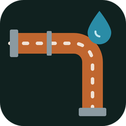
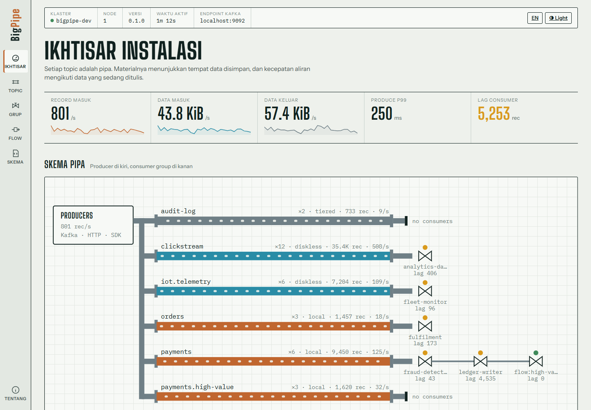
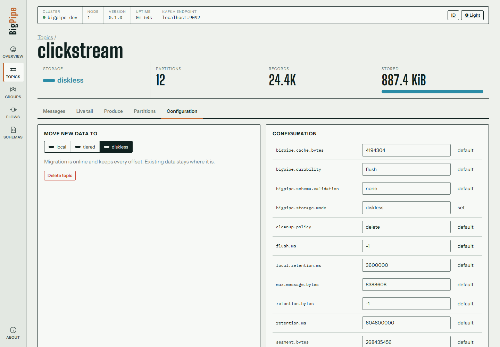
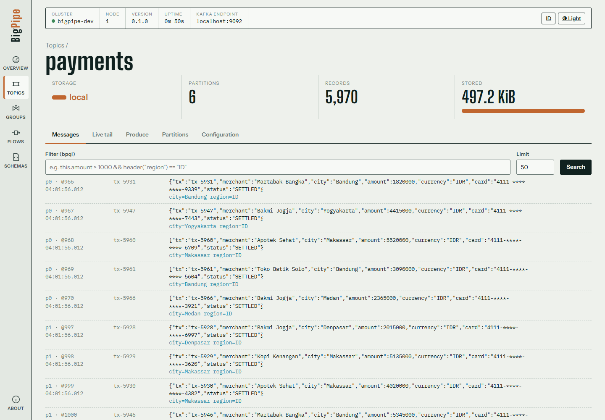
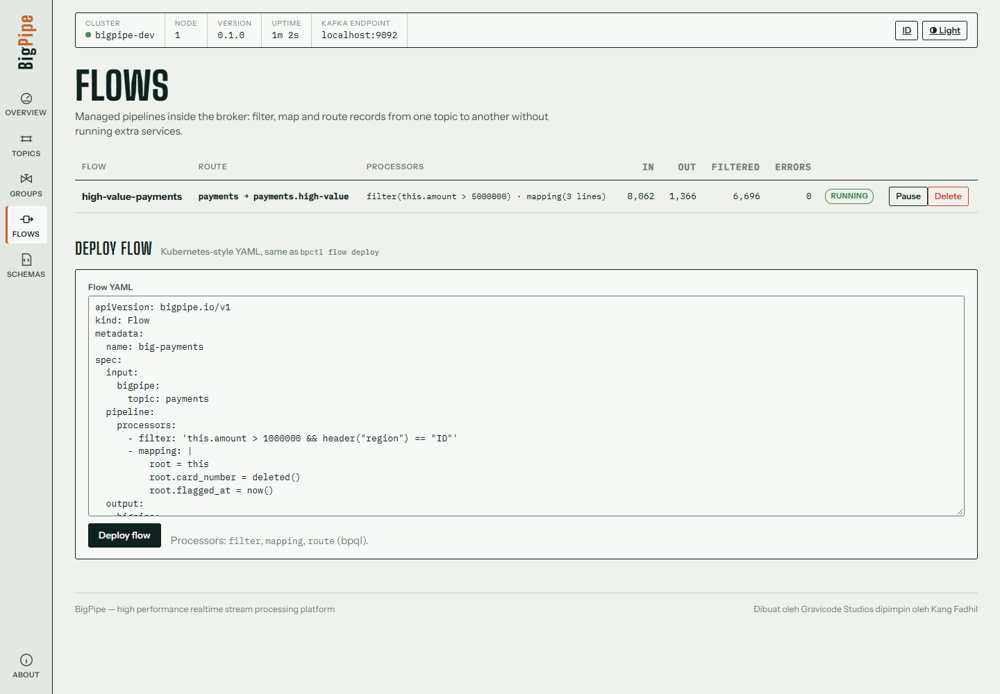
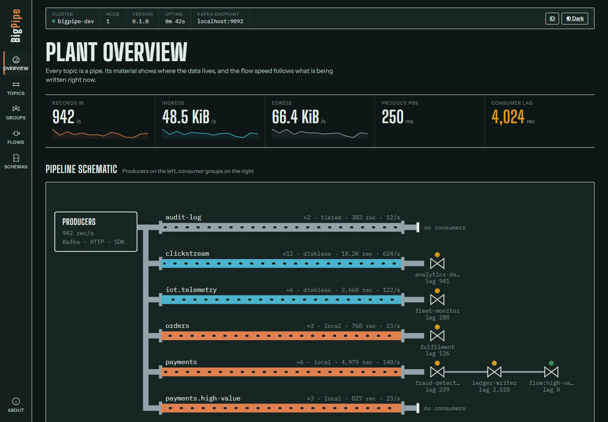
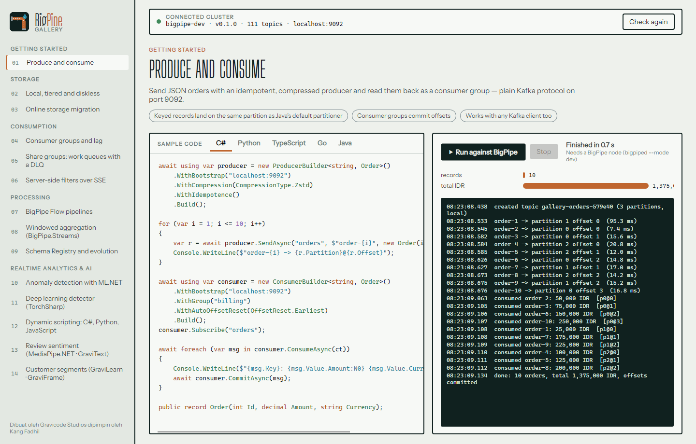
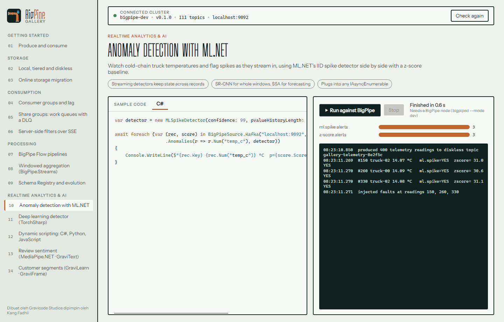
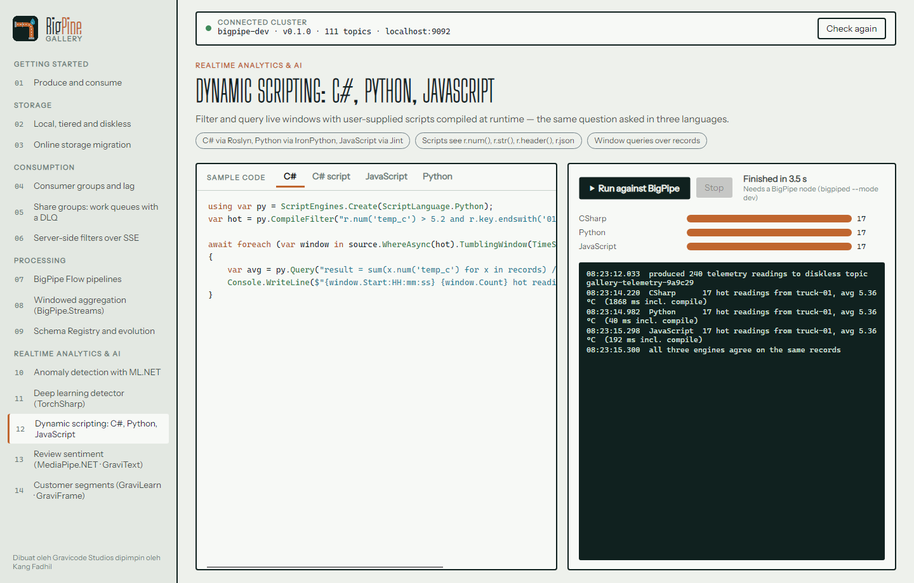
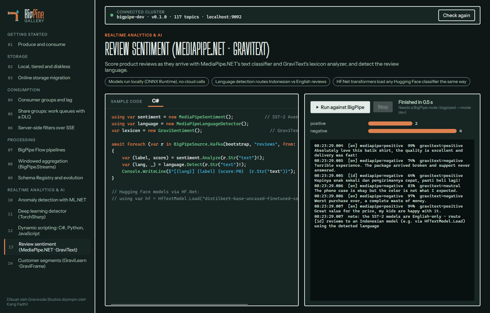

<p align="center">
  
</p>

<h1 align="center">BigPipe</h1>

<p align="center">
  <b>Streaming realtime berperforma tinggi yang kompatibel dengan Kafka, dengan penyimpanan yang dipilih per topic.</b><br/>
  Data plane Rust · control plane dan ekosistem .NET 10 · SDK untuk .NET, Python, TypeScript, Go, dan Java
</p>

<p align="center">
  <a href="README.md">English</a> · <a href="README.id.md">Bahasa Indonesia</a> · <a href="docs/README.md">Dokumentasi</a>
</p>



## Mengapa BigPipe

- **Berbicara Kafka.** Producer, consumer, dan tool yang sudah ada (klien Java, librdkafka, kafka-python, franz-go …) tersambung ke port 9092 tanpa perubahan.
- **Penyimpanan dipilih per topic.** Pakai `local` untuk latensi milidetik, `tiered` untuk retensi panjang yang murah, dan `diskless` untuk node broker tanpa disk yang menulis langsung ke S3, GCS, atau Azure Blob. Anda bisa **memigrasikan topic yang sedang berjalan** antar-mode, dan offset tidak pernah berubah.
- **Dirancang untuk throughput.** Broker Rust thread-per-core tanpa lock di jalur panas, record batch zero-copy yang disimpan dalam format wire Kafka, group commit, dan fsync di luar jalur request. Satu laptop mampu produce ~450 MiB/s, atau ~5 juta record kecil/detik ([benchmark](docs/id/operations.md#benchmark)).
- **Lebih dari sekadar log.** Ada filter di sisi server (bpql), pipeline di dalam broker (BigPipe Flow), share group (antrean kerja dengan DLQ), akses HTTP/SSE, dan consumer group HTTP.
- **Analitik tepat di aliran data.** BigPipe.Streams (gaya Kafka Streams), plus analitik realtime dengan ML.NET, TorchSharp, GravicodeScience, HF.Net, MediaPipe.NET, dan skrip pengguna dalam C#, Python, atau JavaScript.
- **Tool sudah termasuk:** Console web, Schema Registry kompatibel Confluent, gateway AdminApi dengan role dan audit, `bpctl`, aplikasi desktop BigPipe Gallery, dan notebook .NET.

## Mulai cepat

```bash
cargo build --release -p bigpiped -p bpctl
./target/release/bigpiped --mode dev            # Kafka :9092 · HTTP :8082 · admin :9644 · metrik :9645

./target/release/bpctl topic create orders -p 6
echo '{"id":1,"amount":150000}' | ./target/release/bpctl produce orders --key order-1
./target/release/bpctl consume orders --from-beginning --filter 'this.amount > 100000'
./target/release/bpctl topic migrate orders --to diskless     # online, offset tidak berubah

dotnet run -c Release --project control-plane/src/BigPipe.Console   # http://localhost:8080
dotnet run -c Release --project samples/BigPipe.Gallery             # galeri desktop berisi 14 kasus
```

Atau pakai Docker: `docker compose -f deploy/docker/docker-compose.yml up -d --build` (sudah termasuk MinIO).

## Klien

| | Instalasi | Contoh |
|---|---|---|
| .NET | `dotnet add package BigPipe.Client` | `await producer.SendAsync("orders", "k", order)` |
| Python | `pip install bigpipe` | `await Producer(bootstrap="localhost:9092").send("orders", {...})` |
| TypeScript | `npm install bigpipe-client` | `await new Producer({bootstrap:["localhost:9092"]}).send({topic:"orders", value:{...}})` |
| Go | `go get github.com/DotNetVibeCoderz/Vibe_Messaging/BigPipe/sdk/go` | `p.Send(ctx, &bigpipe.Record{Topic: "orders", Value: b})` |
| Java | `io.gravicode:bigpipe-client` | `producer.send("orders", "k", json).join()` |
| klien Kafka apa pun | — | `bootstrap.servers=localhost:9092` |

Paket tambahan .NET: `BigPipe.Streams`, `BigPipe.Analytics`, `.Analytics.Scripting`, `.Analytics.ML`, `.Analytics.Torch`, dan `.Analytics.Gravicode`.

## Screenshot

| Console: konfigurasi topic dan migrasi online | Console: penjelajah pesan dengan filter bpql |
|---|---|
|  |  |
| **Console: flow** | **Console (gelap)** |
|  |  |
| **Gallery: produce dan consume** | **Gallery: deteksi anomali ML.NET** |
|  |  |
| **Gallery: skrip dinamis (C#, Python, JS)** | **Gallery: sentimen dengan MediaPipe.NET (gelap)** |
|  |  |

## Struktur repositori

```
crates/            Rust: bp-protocol, bp-expr, bp-storage, bp-broker, bp-gateway, bigpiped
tools/bpctl        CLI dan pembangkit beban
sdk/dotnet         BigPipe.Client, BigPipe.Streams, BigPipe.Analytics(.Scripting/.ML/.Torch/.Gravicode) + tes
sdk/python|typescript|go|java
control-plane/src  BigPipe.Console (Blazor), BigPipe.SchemaRegistry, BigPipe.AdminApi
samples/           BigPipe.Gallery (Avalonia), BigPipe.Demo, notebooks/
tests/             compat (librdkafka, kafka-python), integration (lokal / S3 / Azure)
deploy/            Docker, compose, systemd, contoh konfigurasi
docs/              dokumentasi en/ dan id/, images/
```

## Dokumentasi

[Memulai](docs/id/getting-started.md) · [Arsitektur](docs/id/architecture.md) · [SDK](docs/id/sdks.md) · [API HTTP & admin](docs/id/http-api.md) · [bpql, Flow, share group](docs/id/bpql-and-flows.md) · [Streams & analitik](docs/id/streams-and-analytics.md) · [Console & Gallery](docs/id/apps.md) · [Operasional](docs/id/operations.md)

Roadmap: [PLAN.md](PLAN.md) · Progres: [Progress.md](Progress.md)

## Status

Versi 0.1.0 adalah rilis **satu node**. Protokol Kafka, tiga mode penyimpanan, migrasi online, group, share group, flow, gateway HTTP, semua SDK, dan ekosistem .NET sudah berfungsi dan teruji. Replikasi (Raft), transaksi, compaction, dan item lain di desain sudah direncanakan; lihat [PLAN.md](PLAN.md).

## Lisensi

Apache License 2.0. Lihat [LICENSE](LICENSE).

---

<p align="center"><b>Dibuat oleh Gravicode Studios dipimpin oleh Kang Fadhil</b></p>
