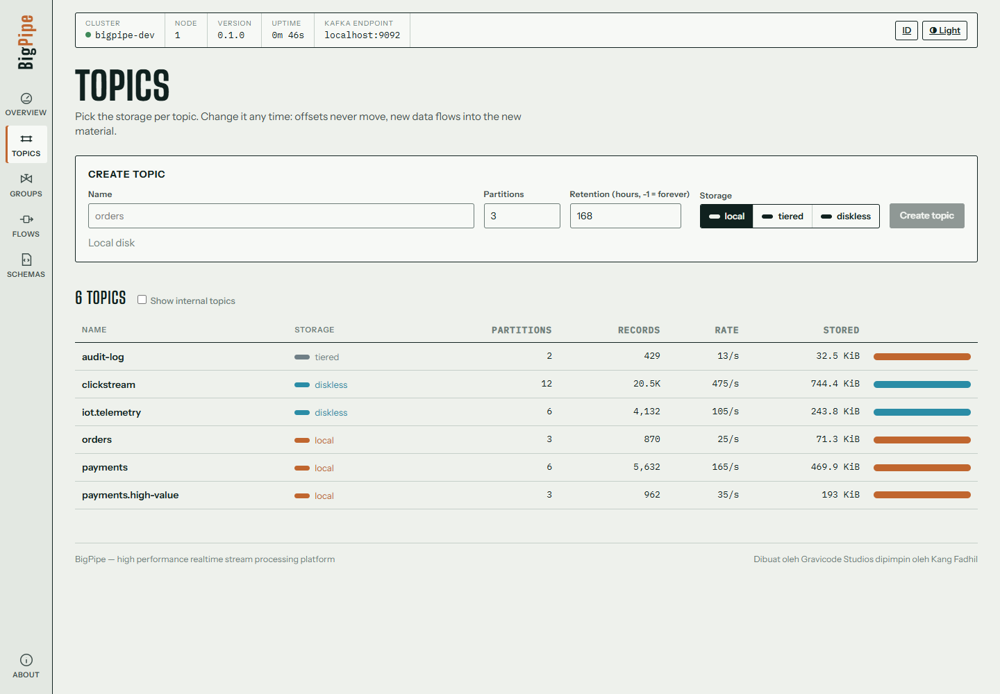
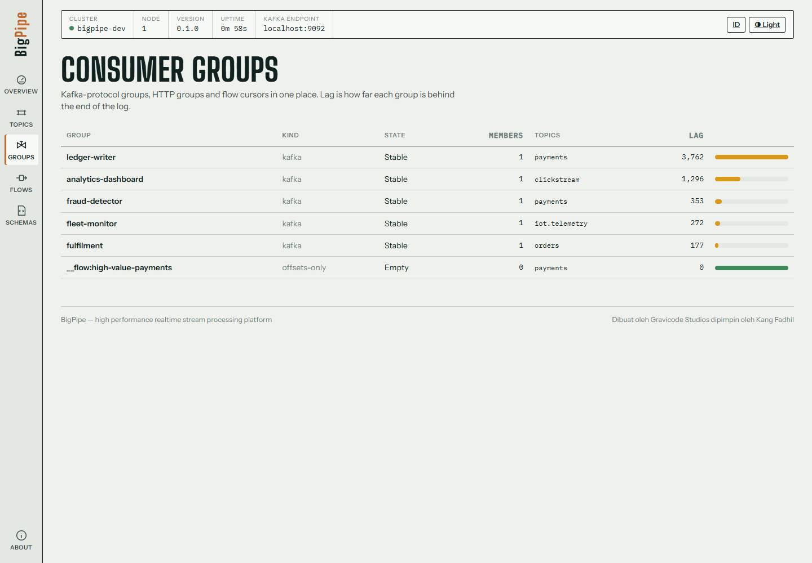
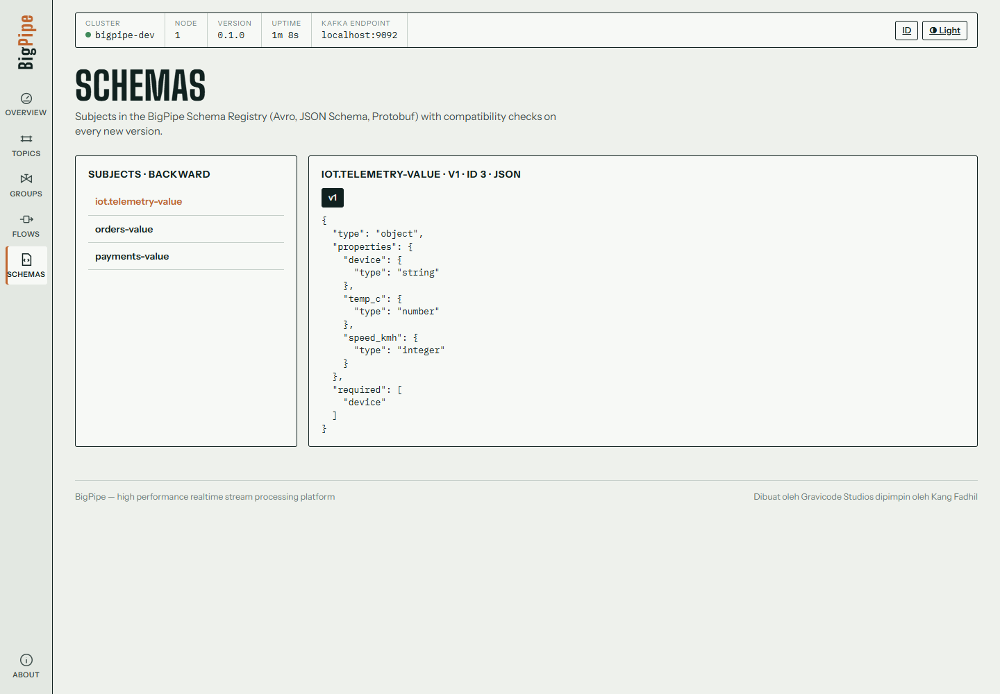
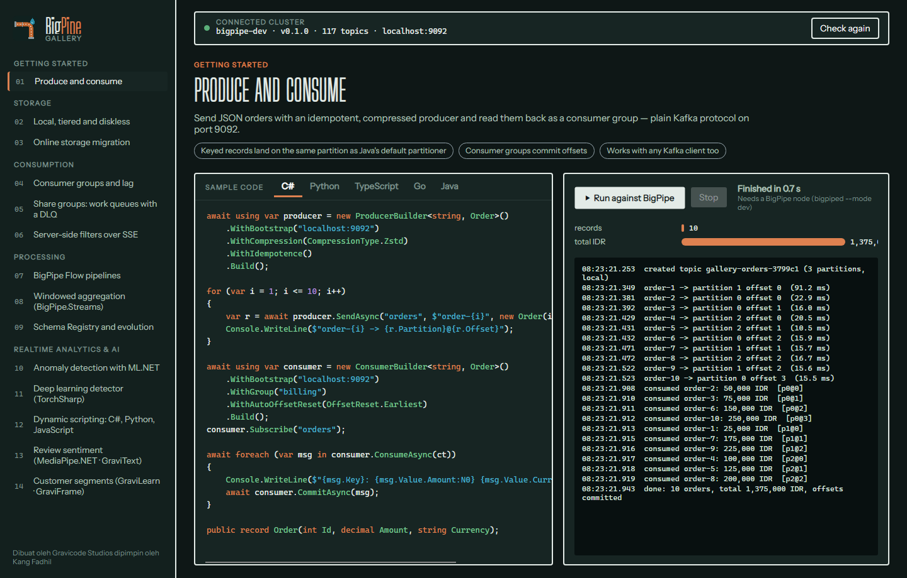
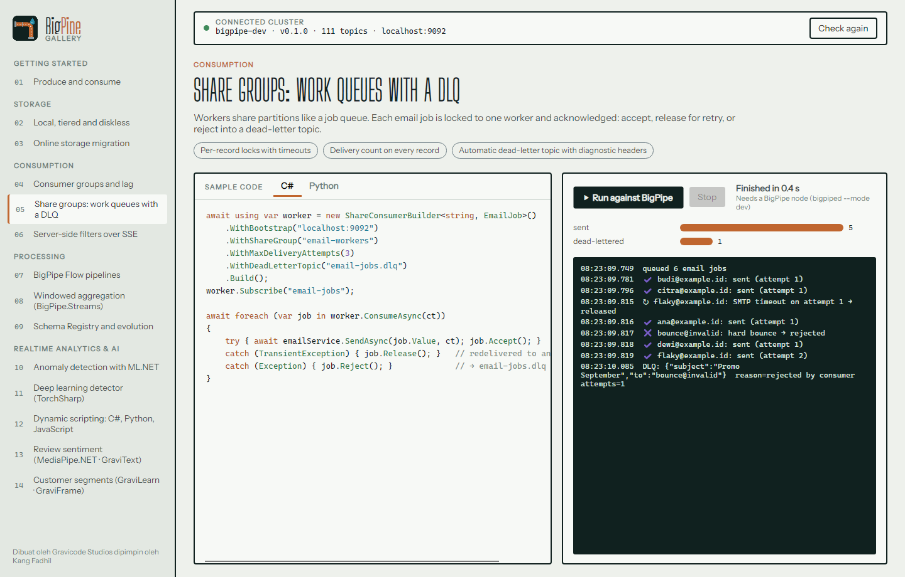

# Console, Gallery and sample apps

[English](apps.md) · [Bahasa Indonesia](../id/apps.md)

## BigPipe Console (web)

`control-plane/src/BigPipe.Console` is a Blazor Server app. It talks to the admin API (9644), the HTTP gateway (8082) and the Schema Registry (8081). Its look is inspired by process-plant schematics: data is drawn as material flowing through pipes into tanks.

```bash
dotnet run -c Release --project control-plane/src/BigPipe.Console
# http://localhost:8080  (settings: BigPipe:AdminUrl, BigPipe:HttpUrl, BigPipe:RegistryUrl, BigPipe:ApiKey)
```

| Page | What you can do |
|---|---|
| **Overview** | a live schematic with producers on the left, topics as pipes (the material shows the storage mode, the flow speed follows the write rate) and consumer groups on the right; records in, ingress, egress and consumer lag |
| **Topics** | list with the storage mode, partitions, records and bytes (local / object storage / diskless); create a topic |
| **Topic detail** | partitions and offsets, effective configuration (edit in place), **online migration** between local, tiered and diskless, a message browser with bpql filters, a live tail and a producer form |
| **Consumer groups** | members, assignment, committed offsets and lag per partition, offset reset (earliest / latest / a specific offset) |
| **Flows** | deploy, pause, resume and delete BigPipe Flow pipelines, from a Kubernetes-style YAML editor (the same format `bpctl flow deploy` uses), with live stats (in / out / filtered / errors) |
| **Schemas** | subjects, versions, compatibility level and schema text from the registry |
| **About** | versions, listeners and credits |

Use the switch in the header to change the language (English / Bahasa Indonesia) and the theme (light / dark). Both choices are remembered in a cookie.

| | |
|---|---|
|  |  |
|  |  |
|  |  |
|  |  |

In Bahasa Indonesia:


## BigPipe Gallery (desktop, Avalonia)

`samples/BigPipe.Gallery` is a cross-platform desktop app (Windows, macOS, Linux) built with Avalonia UI. It contains **14 runnable use cases**. Each one comes with sample code in C#, and most also in Python, TypeScript, Go, Java, `bpctl` or `curl`. Press **Run against BigPipe** and the case runs live against your cluster, with its output and metrics shown next to the code.

```bash
dotnet run -c Release --project samples/BigPipe.Gallery
dotnet run -c Release --project samples/BigPipe.Gallery -- --run-all        # headless smoke test of every case
```

Settings: the `BIGPIPE_BOOTSTRAP`, `BIGPIPE_HTTP`, `BIGPIPE_ADMIN` and `BIGPIPE_REGISTRY` environment variables (defaults are localhost and the standard ports).

| Category | Cases |
|---|---|
| Getting started | Produce and consume |
| Storage | Local, tiered and diskless · Online storage migration |
| Consumption | Consumer groups and lag · Share groups: work queues with a DLQ · Server-side filters over SSE |
| Processing | BigPipe Flow pipelines · Schema Registry and evolution · Windowed aggregation (BigPipe.Streams) |
| Realtime analytics & AI | Anomaly detection with ML.NET · Deep learning detector (TorchSharp) · Dynamic scripting: C#, Python, JavaScript · Review sentiment (MediaPipe.NET · GraviText) · Customer segments (GraviLearn · GraviFrame) |

| | |
|---|---|
|  |  |
|  |  |
|  |  |

## BigPipe Demo (traffic generator)

`samples/BigPipe.Demo` keeps a realistic workload running, so the Console always has something to show. It runs orders and payments on local topics, clickstream and IoT telemetry on diskless topics, an audit log on tiered storage, a flow, and two consumer groups (one keeps up, one lags).

```bash
dotnet run -c Release --project samples/BigPipe.Demo
```

## Notebooks

See [Stream processing and realtime analytics → Notebooks](streams-and-analytics.md#notebooks).

## Regenerating screenshots

```bash
python tools/screenshots/capture.py                       # Console pages (Playwright + installed Chrome)
dotnet run --project samples/BigPipe.Gallery -- --screenshot docs/images          # Gallery, light
dotnet run --project samples/BigPipe.Gallery -- --screenshot docs/images --dark   # Gallery, dark
```

---

*Dibuat oleh Gravicode Studios dipimpin oleh Kang Fadhil.*
