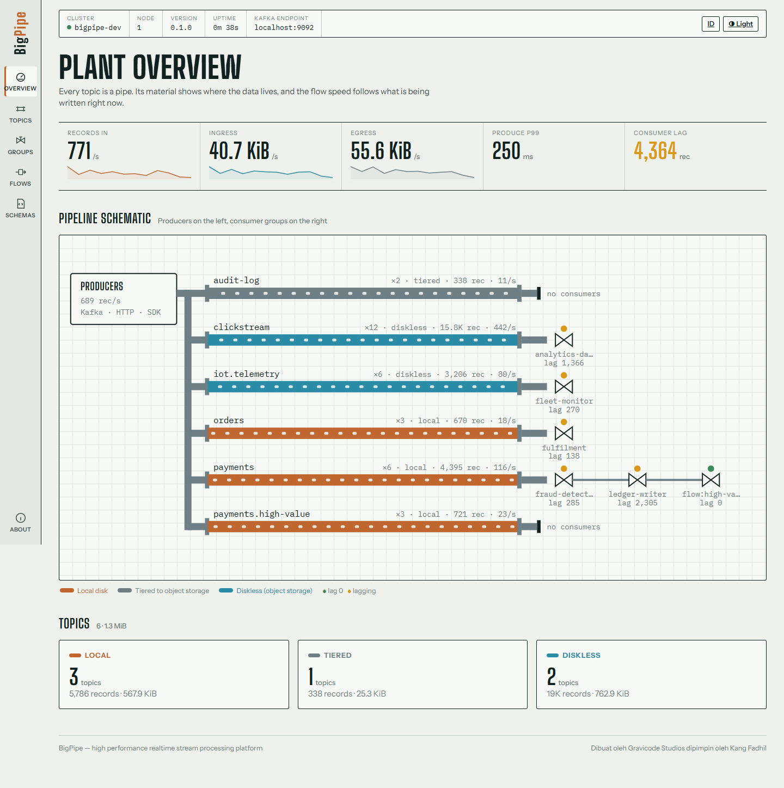

# Getting started

[English](getting-started.md) · [Bahasa Indonesia](../id/getting-started.md)

This guide gets a BigPipe node running on your machine, then walks you through a first produce/consume from the command line, from a Kafka client and from the HTTP gateway.

## 1. Prerequisites

| Tool | Version | Needed for |
|---|---|---|
| Rust | 1.85+ (stable) | the `bigpiped` broker and the `bpctl` CLI |
| .NET SDK | 10.0 | .NET SDK, Streams, Analytics, Console, Schema Registry, Gallery, notebooks |
| Python / Node.js / Go / Java | 3.9+ / 18+ / 1.22+ / 17+ | only if you use that SDK |
| Docker (optional) | 24+ | `deploy/docker/docker-compose.yml` |

## 2. Build and run the broker

```bash
cargo build --release -p bigpiped -p bpctl
./target/release/bigpiped --mode dev --data-dir ./data
```

`--mode dev` runs every role in one process with local defaults. It prints a banner that lists its listeners:

| Port | Listener |
|---|---|
| 9092 | Kafka wire protocol (any Kafka client works) |
| 8082 | HTTP gateway: REST produce/fetch, SSE streaming, HTTP consumer groups, share groups |
| 9644 | Admin API (Console, `bpctl`, SDK admin clients) |
| 9645 | `/metrics` in OpenMetrics format |

You can set any option with a flag, an environment variable (`BIGPIPE_*`) or a YAML file (`--config deploy/config/bigpipe.yaml`). See [Operations](operations.md).

## 3. First records with `bpctl`

```bash
bpctl topic create orders --partitions 6              # local storage
bpctl topic create clicks -p 12 --mode diskless       # straight to object storage
echo '{"id":1,"amount":150000}' | bpctl produce orders --key order-1 -H source=cli
bpctl consume orders --from-beginning -n 10
bpctl consume orders --from-beginning --filter 'this.amount > 100000'
bpctl topic migrate orders --to tiered                # online; offsets never change
bpctl topic create users -c cleanup.policy=compact    # keeps the latest record per key
bpctl topic compact users                             # compact now (also runs in the background)
bpctl group list
```

## 4. From any Kafka client

BigPipe speaks the Kafka protocol, so existing tools work unchanged:

```python
# pip install confluent-kafka
from confluent_kafka import Producer, Consumer
p = Producer({"bootstrap.servers": "localhost:9092", "enable.idempotence": True, "compression.type": "zstd"})
p.produce("orders", key="order-2", value='{"id":2,"amount":99000}'); p.flush()

c = Consumer({"bootstrap.servers": "localhost:9092", "group.id": "billing", "auto.offset.reset": "earliest"})
c.subscribe(["orders"])
print(c.poll(5).value())
```

The compatibility suite `tests/compat/python_compat.py` checks librdkafka (confluent-kafka) and kafka-python against a running node.

## 5. Over HTTP

```bash
curl -X POST localhost:8082/v1/topics/orders/records \
     -H 'content-type: application/json' \
     -d '{"records":[{"key":"order-3","value":{"id":3,"amount":250000},"headers":{"region":"ID"}}]}'

curl 'localhost:8082/v1/topics/orders/partitions/0/records?offset=earliest&limit=10'

# Server-Sent Events; the broker applies the filter, so only matches cross the network
curl -N -G localhost:8082/v1/topics/orders/stream      --data-urlencode from=earliest --data-urlencode 'filter=header("region") == "ID"'
```

## 6. With an SDK

```csharp
// dotnet add package BigPipe.Client
await using var producer = new ProducerBuilder<string, string>().WithBootstrap("localhost:9092").Build();
var meta = await producer.SendAsync("orders", "order-4", """{"id":4,"amount":75000}""");
```

The same flow in Python, TypeScript, Go and Java is in [SDKs](sdks.md).

## 7. Tools with a UI

```bash
dotnet run -c Release --project control-plane/src/BigPipe.Console         # http://localhost:8080
dotnet run -c Release --project control-plane/src/BigPipe.SchemaRegistry  # http://localhost:8081
dotnet run -c Release --project samples/BigPipe.Gallery                   # desktop app
dotnet run -c Release --project samples/BigPipe.Demo                      # generates live traffic
```



## 8. Everything in Docker

```bash
docker compose -f deploy/docker/docker-compose.yml up -d --build
```

This starts MinIO (S3), `bigpiped` with MinIO as its object store, the Schema Registry (8081), the AdminApi gateway (9650) and the Console (8080). The broker advertises itself as `bigpiped`. To use a Kafka client from the host, add `127.0.0.1 bigpiped` to your hosts file. The HTTP (8082) and admin (9644) ports work without it.

---

*Dibuat oleh Gravicode Studios dipimpin oleh Kang Fadhil.*
