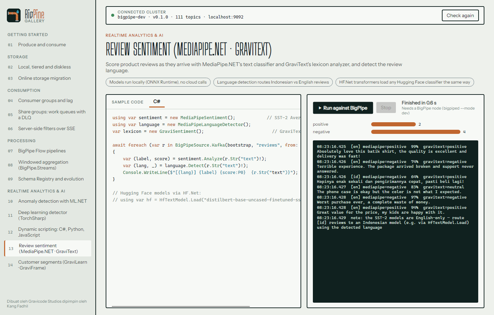

# Stream processing and realtime analytics

[English](streams-and-analytics.md) · [Bahasa Indonesia](../id/streams-and-analytics.md)

BigPipe has three layers for processing data as it arrives. You can mix them.

| Layer | Runs | Use it for |
|---|---|---|
| **BigPipe Flow** | inside the broker (Rust) | filtering, masking, routing, reshaping ([details](bpql-and-flows.md)) |
| **BigPipe.Streams** | in your .NET service | stateful processing: joins, windowed aggregates, tables, exactly the Kafka Streams model |
| **BigPipe.Analytics** (+ Scripting / ML / Torch / Gravicode) | in your .NET service or notebook | statistics, sketches, anomaly detection, ML and deep-learning scoring, user-supplied scripts |

## BigPipe.Streams

```csharp
var topology = new StreamsBuilder();
topology.Stream<string, Payment>("payments")
    .Filter((_, p) => p.Status == "SETTLED")
    .GroupBy((_, p) => p.MerchantId)                                  // repartitions by the new key
    .WindowedBy(TumblingWindow.Of(TimeSpan.FromMinutes(1)).Grace(TimeSpan.FromMinutes(2)))
    .Aggregate(() => new MerchantTotals(),
               (_, p, acc) => acc with { Count = acc.Count + 1, Amount = acc.Amount + p.Amount },
               Stores.Persistent("merchant-totals"))                   // backed by a changelog topic
    .ToStream()
    .To("merchant-totals-1m");

await using var app = new StreamsApp(topology, new StreamsConfig { ApplicationId = "merchant-aggregator", Bootstrap = "localhost:9092" });
await app.StartAsync();

var store = app.Store<Windowed<string>, MerchantTotals>("merchant-totals");   // interactive query
```

- **Operators:** `Filter`/`FilterNot`, `Map`, `MapValues`, `FlatMap`, `FlatMapValues`, `SelectKey`, `Peek`, `Branch`, `Merge`, `GroupByKey`/`GroupBy`, `Count`, `Reduce`, `Aggregate`, stream–table `Join`/`LeftJoin` (tables come from `builder.Table<K,V>(topic)`), `ToStream`, `To`.
- **Windows:** `TumblingWindow`, `HoppingWindow`, `SlidingWindow` and `SessionWindow`, each with a grace period for late records.
- **State:** `Stores.Persistent` keeps state in memory and writes every change to `<app>-<store>-changelog`. This is a compacted topic (`cleanup.policy=compact`, created on start), so it keeps the latest value per key without expiring. On restart, the store is rebuilt from that topic. `Stores.InMemory` skips the changelog.
- **Scaling:** partitions are split across instances with the same `ApplicationId` through a normal consumer group.

## BigPipe.Analytics

Everything is an `IAsyncEnumerable<AnalyticsRecord>`, so analytics code composes with plain C#.

```csharp
using BigPipe.Analytics;

var source = BigPipeSource.Kafka("localhost:9092", "iot.telemetry", from: OffsetReset.Earliest);
// or BigPipeSource.Http("http://localhost:8082", "iot.telemetry", filter: "this.site == \"JKT\"")

await foreach (var w in source.TumblingWindow(TimeSpan.FromSeconds(10)))
{
    var s = WindowSummary.Of(w, "temp_c");            // count, sum, mean, stddev, min, max, p50, p95
    Console.WriteLine($"{w.Start:T}  n={s.Count}  mean={s.Mean:0.0}  p95={s.P95:0.0}");
}
```

| Group | Types |
|---|---|
| Sources and sinks | `BigPipeSource.Kafka` / `.Http` / `.FromEnumerable`, `SinkToBigPipeAsync` |
| Operators | `WhereAsync`, `SelectAsync`, `TakeAsync`, `CollectAsync`, `TumblingWindow`, `SlidingWindow`, `CountWindow`, `GroupWindow` |
| Streaming statistics | `RunningStats` (Welford), `Ewma`, `QuantileSketch`, `RateMeter` |
| Sketches | `HyperLogLog` (distinct counts), `CountMinSketch` (frequencies), `TopK` (heavy hitters) |
| Detectors | `ZScoreDetector`, `EwmaDetector`, `MadDetector`; use them through `.Anomalies(value, detector)` or `.Detect(...)` |

## Dynamic scripting: C#, Python, JavaScript (`BigPipe.Analytics.Scripting`)

Filters and queries can come from users, config files or a UI. They're compiled at runtime by Roslyn (C#), IronPython or Jint (JavaScript).

```csharp
using var engine = ScriptEngines.Create(ScriptLanguage.Python);   // CSharp | Python | JavaScript

var big = source.WhereScript(engine, "r.num('total') > 500000 and r.header('region') == 'ID'");
await foreach (var (window, result) in big.TumblingWindow(TimeSpan.FromMinutes(1))
                   .QueryWindows(engine, "result = sum(x.num('items') for x in records) / len(records)"))
    Console.WriteLine($"{window.Start:T} avg items {result}");
```

| Language | Filter | Query over a window |
|---|---|---|
| C# | `r.num("total") > 500000 && r.header("region") == "ID"` | `records.Average(x => x.num("items"))` |
| Python | `r.num('total') > 500000 and r.header('region') == 'ID'` | `result = sum(x.num('items') for x in records) / len(records)` |
| JavaScript | `r.num('total') > 500000 && r.header('region') === 'ID'` | `records.reduce((s, x) => s + x.num('items'), 0) / records.length` |

Every language sees the same record API: `r.num(path)`, `r.str(path)`, `r.flag(path)`, `r.header(name)`, `r.key` and `r.json`. A filter or projection is compiled once (`CompileFilter`, `CompileProjection`) and then called for each record. Queries are cached by their text. Scripts run in-process, so only accept scripts from trusted users.

## ML.NET (`BigPipe.Analytics.ML`)

| Type | What it does |
|---|---|
| `MLSpikeDetector` | IID spike detection on a single metric, one record at a time |
| `MLChangePointDetector` | detects level shifts |
| `SrCnnWindowDetector` | SR-CNN anomaly detection over whole windows |
| `SsaForecaster` / `SsaForecast` | Singular Spectrum Analysis forecasting with confidence bounds |
| `StreamingBinaryClassifier` | trains on labelled records as they stream in and retrains on the fly |
| `MLModelScorer<TIn,TOut>` | loads a saved ML.NET `.zip` model and scores records |

```csharp
var detector = new MLSpikeDetector(confidence: 99, pvalueHistoryLength: 60);
await foreach (var (rec, score) in source.Anomalies(r => r.Num("temp_c"), detector))
    Console.WriteLine($"{rec.Key} {rec.Num("temp_c")} °C  p={score.Score:0.000}");
```

**Linux:** ML.NET's native MKL library (used by `SrCnnWindowDetector` and `SsaForecaster`) needs Intel OpenMP, `libiomp5.so`, which the NuGet package does not include. Install LLVM's compatible build with `sudo apt-get install libomp-dev`, then link it under the name MKL looks for, in a directory the loader always searches: `sudo ln -sf "$(readlink -f $(find /usr/lib -name libomp.so.5 | head -1))" /usr/lib/$(uname -m)-linux-gnu/libiomp5.so`. Windows and macOS need nothing extra.


## TorchSharp (`BigPipe.Analytics.Torch`)

| Type | What it does |
|---|---|
| `TorchAutoencoderDetector` | an online autoencoder over several features. It learns how values relate to each other and flags records that break the pattern, even when every single value looks normal |
| `TorchWindowDetector` | the same model over sliding windows of a single series |
| `TorchScriptScorer` | scores records with an exported TorchScript model |

Add `TorchSharp-cpu` (or a `TorchSharp-cuda-*` package) to your app for the native runtime.

## GravicodeScience, HF.Net, MediaPipe.NET (`BigPipe.Analytics.Gravicode`)

| Type | Library | What it does |
|---|---|---|
| `WindowFrames.ToDataFrame` | GraviFrame | turns a window into a pandas-style DataFrame (`Describe()`, group-by, …) |
| `GraviKMeansSegmenter` | GraviLearn | K-Means fitted on a window, then used to assign each new record to a segment |
| `GraviOneClassSvmDetector` | GraviLearn | novelty detection with a one-class SVM |
| `GraviSentiment` | GraviText | lexicon-based sentiment, no model download needed |
| `HfTextModel` / `SemanticFilter` | HF.Net (GraviTransformers) | load a Hugging Face model (`HfTextModel.Load("repo/id")`) to classify, embed, or filter by meaning |
| `MediaPipeSentiment` / `MediaPipeLanguageDetector` | MediaPipe.NET | on-device text classification and language detection |

```csharp
using var sentiment = new MediaPipeSentiment();
using var language = new MediaPipeLanguageDetector();
await foreach (var r in BigPipeSource.Kafka(bootstrap, "reviews", from: OffsetReset.Earliest))
{
    var (label, score) = sentiment.Analyze(r.Str("text")!);
    var (lang, _) = language.Detect(r.Str("text")!);
    Console.WriteLine($"[{lang}] {label} {score:P0}");
}
```

Models run locally on ONNX Runtime and are downloaded to the user cache on first use. `OnnxRuntimeNative.EnsureLoaded()` makes sure the ONNX Runtime from NuGet is loaded rather than an older copy that Windows ships in System32.



## Notebooks

`samples/notebooks` contains .NET Interactive notebooks (Polyglot Notebooks in VS Code, or Jupyter with the .NET kernel). Every notebook is bilingual and produces its own sample data.

| Notebook | Topic |
|---|---|
| `01-streaming-statistics` | windows, Welford stats, quantiles, HyperLogLog, Count-Min, Top-K |
| `02-anomaly-detection-mlnet` | spike / change-point / SR-CNN detection and SSA forecasting with ML.NET |
| `03-deep-learning-torchsharp` | online autoencoder for multivariate sensor data |
| `04-dynamic-scripting` | the same filter and query in C#, Python and JavaScript |
| `05-gravicode-science` | GraviFrame DataFrames, GraviLearn K-Means and one-class SVM |
| `06-nlp-mediapipe-hfnet` | MediaPipe.NET sentiment and language detection, HF.Net transformers |
| `07-streams-and-flows` | BigPipe.Streams windowed aggregates and a BigPipe Flow |

Before you open a notebook, start `bigpiped` on the default ports. The notebooks reference the NuGet packages. To try them against local builds, regenerate them with `python tools/notebooks/build_notebooks.py --local-feed artifacts/nuget`. `tools/notebooks/run_notebooks.py` runs all of them headless with `dotnet-repl` and reports any cell errors.

---

*Dibuat oleh Gravicode Studios dipimpin oleh Kang Fadhil.*
