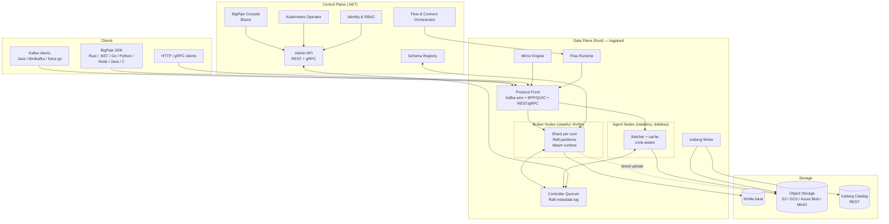
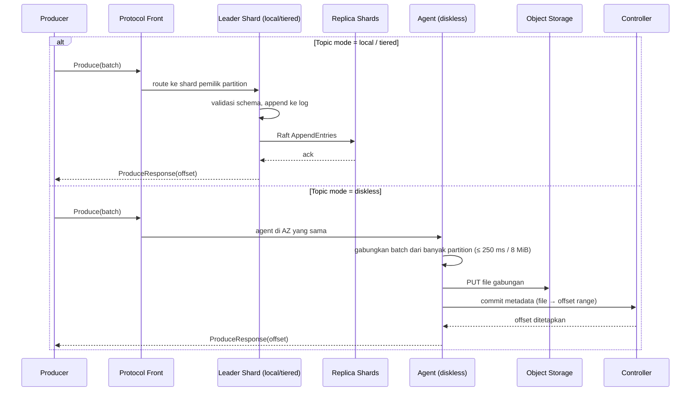
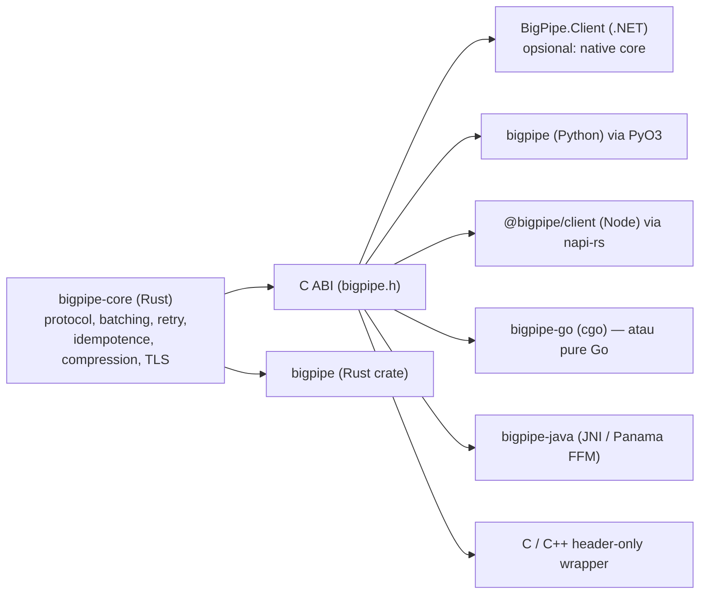
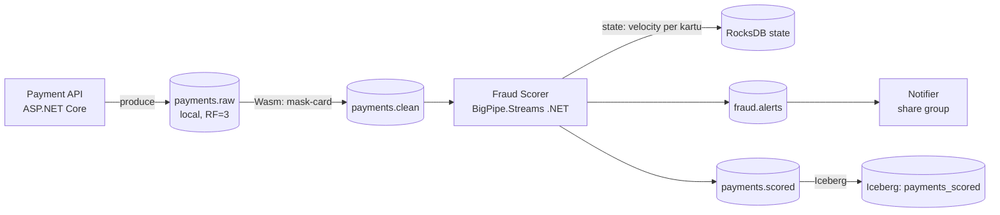

# BigPipe — Solution Design Document

**Platform Realtime Stream Processing Berkinerja Tinggi**
Rust (data plane, low-level binary) + .NET (control plane, ekosistem, dan tooling)

| Atribut | Nilai |
|---|---|
| Nama produk | BigPipe |
| Versi dokumen | 1.0 (Draft Arsitektur) |
| Status | Proposed |
| Tanggal | 28 September 2026 |
| Lisensi yang diusulkan | Apache 2.0 (core), dengan opsi Enterprise add-on |

---

## Daftar Isi

1. [Ringkasan Eksekutif](#1-ringkasan-eksekutif)
2. [Tujuan, Non-Goals, dan Prinsip Desain](#2-tujuan-non-goals-dan-prinsip-desain)
3. [Sintesis Fitur: Kafka + Redpanda + WarpStream](#3-sintesis-fitur-kafka--redpanda--warpstream)
4. [Arsitektur Tingkat Tinggi](#4-arsitektur-tingkat-tinggi)
5. [Pembagian Tanggung Jawab Rust vs .NET](#5-pembagian-tanggung-jawab-rust-vs-net)
6. [Data Plane (Rust)](#6-data-plane-rust)
7. [Storage Engine dan Tiga Mode Penyimpanan](#7-storage-engine-dan-tiga-mode-penyimpanan)
8. [Replikasi, Konsensus, dan Metadata](#8-replikasi-konsensus-dan-metadata)
9. [Semantik Konsumsi: Consumer Groups, Share Groups, Transaksi](#9-semantik-konsumsi-consumer-groups-share-groups-transaksi)
10. [In-Broker Processing: WebAssembly Transforms](#10-in-broker-processing-webassembly-transforms)
11. [Lakehouse Native: Iceberg Topics](#11-lakehouse-native-iceberg-topics)
12. [Disaster Recovery dan Multi-Region](#12-disaster-recovery-dan-multi-region)
13. [Control Plane (.NET)](#13-control-plane-net)
14. [BigPipe Flow dan BigPipe Streams](#14-bigpipe-flow-dan-bigpipe-streams)
15. [Keamanan](#15-keamanan)
16. [Observability](#16-observability)
17. [Desain Performa dan Target Benchmark](#17-desain-performa-dan-target-benchmark)
18. [Deployment dan Operasional](#18-deployment-dan-operasional)
19. [Client SDK Multi-Bahasa](#19-client-sdk-multi-bahasa)
20. [Sample Code](#20-sample-code)
21. [Sample Applications](#21-sample-applications)
22. [Struktur Repository](#22-struktur-repository)
23. [Struktur Dokumentasi Produk](#23-struktur-dokumentasi-produk)
24. [Strategi Testing dan Quality Assurance](#24-strategi-testing-dan-quality-assurance)
25. [Roadmap](#25-roadmap)
26. [Risiko dan Trade-off](#26-risiko-dan-trade-off)
27. [Lampiran](#27-lampiran)

---

## 1. Ringkasan Eksekutif

BigPipe adalah platform event streaming dan stream processing yang **kompatibel dengan protokol Apache Kafka**, dirancang untuk menggabungkan kekuatan tiga pendekatan yang saat ini terpisah di pasar:

- **Kematangan semantik dan ekosistem Apache Kafka**: protokol wire yang luas dipakai, consumer group, transaksi exactly-once, log compaction, Kafka Streams, dan Kafka Connect.
- **Efisiensi dan latency rendah Redpanda**: single binary tanpa JVM, arsitektur thread-per-core, replikasi berbasis Raft, schema registry built-in, transformasi WebAssembly di dalam broker, dan Iceberg Topics.
- **Ekonomi cloud WarpStream**: agent stateless tanpa disk, penyimpanan langsung ke object storage, nol biaya replikasi antar-AZ, replikasi cluster yang mempertahankan offset, dan multi-region dengan RPO=0.

Pembeda utama BigPipe adalah **mode penyimpanan per topic**. Dalam satu cluster, tim dapat memilih per topic antara:

| Mode | Karakteristik | Target latency p99 (produce → ack) | Cocok untuk |
|---|---|---|---|
| `local` | Raft di NVMe lokal, replikasi antar broker | < 5 ms | Trading, fraud detection, request/reply |
| `tiered` | Raft lokal untuk data panas, segment lama ke object storage | < 5 ms (panas), retensi tak terbatas | Event sourcing, audit, CDC |
| `diskless` | Langsung ke object storage lewat agent stateless | 150–400 ms | Log, telemetry, clickstream, ingest analytics bervolume besar |

Dengan demikian, organisasi tidak perlu lagi mengoperasikan dua sistem berbeda (satu untuk latency rendah, satu untuk biaya rendah).

Pembagian teknologi:

- **Rust** dipakai untuk semua jalur panas (hot path): broker, agent, storage engine, protocol codec, Raft, runtime WebAssembly, writer Iceberg, dan inti client SDK (`bigpipe-core`) yang diekspos lewat FFI ke banyak bahasa.
- **.NET 10** dipakai untuk control plane dan ekosistem: Admin API, Schema Registry, Console web, Kubernetes Operator, orkestrasi pipeline, konektor enterprise (BigPipe Connect), library stream processing (`BigPipe.Streams`), dan SDK .NET native.

> **Catatan tentang angka performa.** Semua angka di dokumen ini adalah **target desain**, bukan hasil pengukuran. Angka tersebut harus divalidasi melalui metodologi benchmark di [Bagian 17](#17-desain-performa-dan-target-benchmark) sebelum dipublikasikan.

---

## 2. Tujuan, Non-Goals, dan Prinsip Desain

### 2.1 Tujuan

| ID | Tujuan | Ukuran keberhasilan |
|---|---|---|
| G1 | Kompatibel dengan protokol Kafka | Lulus test suite client Java 4.x, librdkafka, franz-go, dan KafkaJS tanpa modifikasi aplikasi |
| G2 | Latency rendah di mode `local` | p99 < 5 ms pada 1 GB/s, `acks=all`, RF=3 |
| G3 | Biaya rendah di mode `diskless` | Nol byte replikasi antar-AZ dari broker; biaya storage setara harga object storage |
| G4 | Elastis | Agent diskless dapat di-scale 0→N dalam < 30 detik tanpa pemindahan data |
| G5 | Operasional sederhana | Satu binary `bigpiped`, tanpa ZooKeeper/JVM, upgrade rolling tanpa downtime |
| G6 | Lakehouse native | Topic dapat langsung dibaca sebagai tabel Iceberg tanpa ETL |
| G7 | Processing terintegrasi | Wasm transforms di broker, pipeline deklaratif, dan library stream processing |
| G8 | Multi-bahasa | SDK resmi untuk Rust, .NET, Java, Go, Python, Node.js/TypeScript, C/C++ |
| G9 | Ketahanan | Multi-region RPO=0 (opsional), mirror yang mempertahankan offset |

### 2.2 Non-Goals (Versi 1.x)

- Tidak mengimplementasikan ulang Kafka Connect runtime Java secara internal. Konektor Kafka Connect yang ada tetap bisa dijalankan terhadap BigPipe karena kompatibel protokol.
- Tidak menyediakan SQL streaming engine penuh sekelas Flink pada versi 1.0. Integrasi dengan Flink/Spark dilakukan lewat protokol Kafka dan Iceberg.
- Tidak mendukung ZooKeeper mode Kafka lama atau protokol Kafka di bawah versi 0.11.

### 2.3 Prinsip Desain

1. **Hot path tanpa alokasi dan tanpa lock.** Setiap core memiliki datanya sendiri (shared-nothing). Komunikasi antar core lewat message passing.
2. **Kompatibilitas dulu, inovasi kemudian.** Setiap fitur baru harus tetap bisa diakses oleh client Kafka standar, atau terisolasi di protokol native yang opsional.
3. **Storage adalah kebijakan per topic, bukan keputusan cluster.**
4. **Control plane boleh mati, data plane tetap jalan.** Kegagalan komponen .NET tidak boleh menghentikan produce/consume.
5. **Data pelanggan tidak meninggalkan akun pelanggan** (model BYOC untuk layanan managed).
6. **Semua bisa diamati.** Setiap operasi menghasilkan metrik, trace, dan log terstruktur dengan overhead terukur.
7. **Deterministic by design.** Komponen inti dapat dijalankan di simulator deterministik untuk pengujian.

---

## 3. Sintesis Fitur: Kafka + Redpanda + WarpStream

Tabel berikut memetakan fitur terbaik dari masing-masing platform ke komponen BigPipe.

| Fitur | Asal inspirasi | Implementasi di BigPipe | Komponen |
|---|---|---|---|
| Protokol wire Kafka | Kafka | Codec zero-copy untuk seluruh API Kafka modern | `bp-protocol` (Rust) |
| Consumer group protocol baru (incremental) | Kafka (KIP-848) | Rebalance server-side yang incremental | `bp-coordinator` (Rust) |
| Share groups / queue semantics | Kafka (KIP-932) | Konsumsi per pesan dengan ack, redelivery, DLQ | `bp-coordinator` (Rust) |
| Exactly-once / transaksi | Kafka | Transaction coordinator berbasis Raft | `bp-txn` (Rust) |
| Log compaction | Kafka | Compaction per core, berjalan di background dengan budget I/O | `bp-storage` (Rust) |
| Tiered storage | Kafka (KIP-405), Redpanda | Mode `tiered` dengan upload segment asinkron | `bp-tiered` (Rust) |
| Library stream processing | Kafka Streams | `BigPipe.Streams` (.NET) dan `bigpipe-streams` (Rust) | .NET + Rust |
| Framework konektor | Kafka Connect | BigPipe Connect (.NET) + kompatibel dengan Kafka Connect | .NET |
| Single binary tanpa JVM | Redpanda | `bigpiped` statically linked | Rust |
| Thread-per-core | Redpanda (Seastar) | Runtime berbasis `glommio`/io_uring dengan shard per core | `bp-runtime` (Rust) |
| Replikasi Raft per partition | Redpanda | Multi-Raft dengan batching heartbeat | `bp-raft` (Rust) |
| Schema Registry built-in | Redpanda | API kompatibel Confluent, disimpan di topic internal | .NET + validasi di Rust |
| Server-side schema validation | Redpanda, WarpStream | Validasi schema ID di broker sebelum ack | `bp-schema-guard` (Rust) |
| HTTP Proxy / REST | Redpanda | REST + gRPC gateway untuk produce/consume | `bp-gateway` (Rust) |
| Wasm data transforms | Redpanda | Runtime `wasmtime` di shard yang sama dengan leader partition | `bp-wasm` (Rust) |
| Iceberg Topics | Redpanda, WarpStream Tableflow | Topic otomatis dimaterialisasi sebagai tabel Iceberg + DLQ table | `bp-iceberg` (Rust) |
| Web console | Redpanda Console | BigPipe Console (Blazor) | .NET |
| Continuous data balancing | Redpanda | Balancer otomatis berbasis beban disk/CPU/network | Controller (Rust) + policy (.NET) |
| Diskless / stateless agents | WarpStream | Mode `diskless`, agent tanpa disk, semua agent bisa melayani partition mana pun | `bp-agent` (Rust) |
| Nol biaya inter-AZ | WarpStream | Zone-aware routing dan penulisan langsung ke object storage | `bp-agent` (Rust) |
| Offset-preserving replication | WarpStream Orbit | BigPipe Mirror | `bp-mirror` (Rust) + .NET orchestrator |
| Multi-region RPO=0 | WarpStream | Metadata quorum lintas region + object storage multi-region | Controller (Rust) |
| Agent groups / roles | WarpStream | Role per node: `broker`, `agent`, `pipelines`, `iceberg`, `compaction` | Rust |
| Managed data pipelines | WarpStream (Bento) | BigPipe Flow: pipeline YAML deklaratif | Runtime Rust + orkestrasi .NET |

### 3.1 Pembeda Khas BigPipe

Selain mengambil fitur terbaik dari ketiga platform, BigPipe menambahkan beberapa kemampuan yang tidak ada di ketiganya secara bersamaan:

1. **Hybrid storage per topic dalam satu cluster** (`local`, `tiered`, `diskless`), termasuk migrasi mode topic secara online.
2. **Native .NET di control plane dan SDK**, sehingga organisasi berbasis .NET mendapatkan pengalaman kelas satu (Kafka dan Redpanda sangat berorientasi JVM/Go/C++).
3. **Satu inti SDK Rust untuk semua bahasa** (`bigpipe-core`), sehingga perilaku batching, retry, dan idempotence konsisten di seluruh bahasa.
4. **Protokol native BigPipe (BPP) opsional** di atas QUIC untuk client yang ingin fitur tambahan (multiplexing tanpa head-of-line blocking, header-level filtering di server), tanpa mengorbankan kompatibilitas Kafka.
5. **Server-side filtering dan projection** di protokol native: consumer bisa meminta hanya record yang cocok dengan predikat header, sehingga menghemat bandwidth.

---

## 4. Arsitektur Tingkat Tinggi

### 4.1 Diagram Komponen



### 4.2 Node Roles

Satu binary `bigpiped` dapat menjalankan satu atau lebih role, dipilih lewat konfigurasi:

| Role | Stateful? | Fungsi |
|---|---|---|
| `controller` | Ya (metadata kecil) | Raft metadata quorum (3 atau 5 node): topic, partition, ACL, konfigurasi, offset diskless |
| `broker` | Ya (NVMe) | Melayani topic `local` dan `tiered`, menjalankan Raft per partition |
| `agent` | Tidak | Melayani topic `diskless`, menulis/membaca object storage |
| `pipelines` | Tidak | Menjalankan BigPipe Flow |
| `iceberg` | Tidak | Materialisasi Iceberg dan maintenance tabel |
| `compaction` | Tidak | Compaction file diskless di object storage |
| `mirror` | Tidak | Replikasi dari/ke cluster lain |

Untuk deployment kecil (dev atau edge), semua role dapat berjalan dalam satu proses: `bigpiped --mode dev`.

### 4.3 Alur Produce (Ringkas)



---

## 5. Pembagian Tanggung Jawab Rust vs .NET

### 5.1 Alasan Pemilihan

| Kriteria | Rust | .NET 10 |
|---|---|---|
| Latency deterministik (tanpa GC pause) | Sangat kuat | Cukup (GC modern, tapi tetap ada pause) |
| Kontrol memori dan I/O (io_uring, direct I/O) | Penuh | Terbatas |
| Keamanan memori | Dijamin compiler | Dijamin runtime |
| Produktivitas untuk API, UI, integrasi enterprise | Sedang | Sangat tinggi |
| Ekosistem enterprise (AD/Entra ID, SQL Server, Azure) | Sedang | Sangat kuat |
| Kubernetes operator, web UI, workflow | Bisa, tapi lambat dikembangkan | ASP.NET Core, Blazor, KubeOps |

Aturan praktis: **apa pun yang disentuh setiap record ditulis dalam Rust; apa pun yang disentuh manusia atau dijalankan per konfigurasi ditulis dalam .NET.**

### 5.2 Peta Komponen

| Lapisan | Komponen | Bahasa | Alasan |
|---|---|---|---|
| Runtime | `bp-runtime` (thread-per-core, io_uring) | Rust | Hot path |
| Protokol | `bp-protocol` (Kafka codec), `bp-bpp` (QUIC), `bp-gateway` (REST/gRPC) | Rust | Parsing setiap request |
| Storage | `bp-storage`, `bp-tiered`, `bp-diskless` | Rust | I/O intensif |
| Konsensus | `bp-raft`, `bp-controller` | Rust | Latency kritikal |
| Coordinator | `bp-coordinator` (groups, share groups), `bp-txn` | Rust | Dipanggil tiap commit |
| Processing | `bp-wasm`, `bp-flow-runtime`, `bp-iceberg` | Rust | Per record |
| Replikasi | `bp-mirror` | Rust | Throughput tinggi |
| SDK inti | `bigpipe-core` + FFI C ABI | Rust | Satu implementasi untuk semua bahasa |
| Admin | `BigPipe.AdminApi` | .NET | REST/gRPC, validasi, audit |
| Registry | `BigPipe.SchemaRegistry` | .NET | Kompatibilitas Avro/Protobuf/JSON Schema |
| UI | `BigPipe.Console` (Blazor Server + WASM) | .NET | Produktivitas UI |
| Operator | `BigPipe.Operator` | .NET | CRD Kubernetes |
| Integrasi | `BigPipe.Connect` | .NET | Konektor enterprise (SQL Server, Dynamics, SAP, dll.) |
| Library | `BigPipe.Streams` | .NET | Stream processing untuk developer .NET |
| SDK .NET | `BigPipe.Client` | .NET (+ Rust core opsional) | Pengalaman idiomatis |

### 5.3 Batas Interaksi Rust ↔ .NET

Komunikasi antara control plane (.NET) dan data plane (Rust) **hanya** melalui:

1. **Admin gRPC API** yang diekspos controller Rust (`bigpipe.admin.v1`), didefinisikan dalam Protobuf. Kontrak ini adalah sumber kebenaran tunggal.
2. **Topic internal** (`__bp_schemas`, `__bp_audit`, `__bp_flow_state`) yang dibaca/ditulis lewat SDK.
3. **FFI** hanya di dalam SDK (`BigPipe.Client.Native`), tidak di server.

Tidak ada pemanggilan FFI antara proses server, sehingga kegagalan .NET tidak dapat merusak memori broker.

---

## 6. Data Plane (Rust)

### 6.1 Runtime Thread-per-Core

- Setiap core CPU menjalankan satu **shard**: event loop tunggal dengan executor asinkron (`glommio` di Linux, fallback `tokio` untuk macOS/Windows khusus mode dev).
- Partition dipetakan ke shard dengan consistent hashing. Semua state partition (log, index, Raft state, cache) dimiliki satu shard, sehingga tidak ada mutex di hot path.
- Komunikasi antar shard melalui **SPSC ring buffer** lock-free.
- I/O disk memakai **io_uring** dengan `O_DIRECT` untuk menghindari double buffering page cache. BigPipe mengelola cache sendiri (per-shard batch cache).
- Alokasi memori memakai **arena per shard** dan slab allocator untuk buffer jaringan; `mimalloc` untuk alokasi umum.
- CPU pinning dan NUMA awareness: shard dipasang ke core, NIC queue di-affinity ke core yang sama bila memungkinkan.

```text
┌────────────────────────── Node (16 core) ──────────────────────────┐
│ Shard 0          Shard 1          ...          Shard 15             │
│ ┌──────────┐     ┌──────────┐                  ┌──────────┐         │
│ │ Net accept│    │ Partitions│                 │ Partitions│        │
│ │ Partitions│    │ Raft      │                 │ Raft      │        │
│ │ Raft      │    │ Wasm VM   │                 │ Wasm VM   │        │
│ │ Cache     │    │ Cache     │                 │ Cache     │        │
│ └────┬─────┘     └────┬─────┘                  └────┬─────┘         │
│      └──── SPSC ring buffers (cross-shard messages) ───┘            │
│                    io_uring per shard → NVMe                        │
└─────────────────────────────────────────────────────────────────────┘
```

### 6.2 Networking dan Protokol

| Front-end | Port default | Keterangan |
|---|---|---|
| Kafka wire protocol | 9092 | Kompatibel client Kafka ≥ 0.11, target parity API Kafka 4.x |
| BPP (BigPipe Protocol) | 9093/UDP (QUIC) | Multiplexed streams, server-side filter, 0-RTT resume |
| REST/HTTP gateway | 8082 | Produce/consume via HTTP, SSE untuk streaming |
| gRPC gateway | 8083 | Produce/consume streaming bidirectional |
| Admin gRPC | 9644 | Dipakai control plane .NET dan `bpctl` |
| Metrics | 9645 | Prometheus/OpenMetrics |

**Codec zero-copy.** Request Kafka di-parse langsung dari buffer penerimaan tanpa menyalin payload record. Record batch disimpan ke disk dalam format wire Kafka (magic v2) apa adanya, sehingga fetch dapat melakukan `sendfile`/`splice` atau pengiriman langsung dari buffer terdaftar io_uring.

**Protokol native BPP** menambah kemampuan yang tidak tersedia di protokol Kafka:

- `FetchFiltered`: filter server-side berdasarkan header (`header("region") == "ID"`), menghemat bandwidth consumer.
- `SubscribePush`: server mendorong record ke client (long-lived stream) tanpa polling.
- `ProduceStream`: satu stream QUIC per partition, tanpa head-of-line blocking antar partition.
- Session resumption dengan token, cocok untuk client mobile/IoT.

### 6.3 Model Data

Kompatibel dengan model Kafka:

- **Topic** → **Partition** → **Record batch** → **Record** (key, value, headers, timestamp).
- Offset monoton per partition.
- Metadata topic tambahan khas BigPipe:

```yaml
topic: payments
partitions: 48
config:
  bigpipe.storage.mode: local        # local | tiered | diskless
  replication.factor: 3
  retention.ms: 604800000
  cleanup.policy: delete
  bigpipe.schema.validation: strict  # none | lenient | strict
  bigpipe.iceberg.enabled: true
  bigpipe.iceberg.mode: value_schema_id
  bigpipe.transform: mask-card-numbers@v3
```

---

## 7. Storage Engine dan Tiga Mode Penyimpanan

### 7.1 Mode `local`

- Log per partition dibagi menjadi **segment** (default 1 GiB) dengan index offset sparse dan time index.
- Penulisan append-only dengan `O_DIRECT`, di-flush per batch Raft (group commit).
- `fsync` dapat dikonfigurasi: `bigpipe.durability = raft_quorum` (default, data aman bila mayoritas replika menulis ke disk) atau `raft_quorum_fsync` (setiap batch di-fsync sebelum ack).
- Cache: batch terbaru disimpan di memori shard (default 30% RAM), sehingga consumer yang "tailing" dilayani dari memori.

### 7.2 Mode `tiered`

- Sama seperti `local` untuk data panas.
- Segment yang sudah ditutup di-upload asinkron ke object storage oleh uploader per shard.
- `local.retention.ms` mengatur berapa lama segment tetap di disk; `retention.ms` mengatur retensi total.
- Fetch untuk offset lama dibaca dari object storage dengan **read-ahead** dan chunk cache (disk lokal sebagai cache L2).
- **Read replica cluster**: cluster lain dapat me-mount topic tiered secara read-only dari bucket yang sama (setara Remote Read Replicas).

### 7.3 Mode `diskless`

Terinspirasi WarpStream, dengan agent stateless:

1. Agent menerima produce dari client **di AZ yang sama** (zone-aware bootstrap: metadata response hanya berisi agent di AZ client).
2. Agent menggabungkan batch dari **banyak partition dan banyak topic** ke satu file (target 4–16 MiB atau 250 ms, mana yang lebih dulu).
3. File di-`PUT` ke object storage.
4. Agent mengirim **commit** ke controller: daftar `(topic, partition, offset_count, byte_range_in_file)`.
5. Controller menetapkan offset secara atomik dan mengembalikannya ke agent, lalu agent mengirim ack ke producer.

**Read path:**
- Consumer terhubung ke agent mana pun di AZ-nya.
- Agent menggunakan **distributed cache per AZ** (consistent hashing antar agent) sehingga satu file hanya di-GET sekali per AZ.
- Latency baca tailing ditekan dengan *read-your-write hint*: agent yang baru menulis file menyimpannya di cache.

**Compaction diskless:** role `compaction` menggabungkan file kecil menjadi file besar yang terurut per partition, dan menerapkan retensi serta log compaction.

**Offset & metadata:** disimpan di controller quorum (Raft), bukan di object storage, sehingga commit cepat (target < 20 ms).

### 7.4 Migrasi Mode Online

`bpctl topic migrate payments --to tiered` melakukan:

1. Freeze leader epoch baru pada offset `N`.
2. Data `< N` tetap dibaca dari lokasi lama, data `≥ N` ditulis ke mode baru.
3. Background mover memindahkan data lama bila diperlukan.
4. Tidak ada perubahan offset; client tidak menyadari migrasi.

### 7.5 Perbandingan Mode

| Aspek | local | tiered | diskless |
|---|---|---|---|
| Latency produce p99 (target) | < 5 ms | < 5 ms | 150–400 ms |
| Latency end-to-end tailing (target) | < 10 ms | < 10 ms | 300–600 ms |
| Biaya inter-AZ | Replikasi RF-1 kali | Replikasi RF-1 kali | Nol dari broker |
| Retensi | Terbatas disk | Tak terbatas | Tak terbatas |
| Scaling | Rebalancing partition | Rebalancing ringan | Instan (stateless) |
| Ketergantungan object storage untuk write | Tidak | Tidak | Ya |

---

## 8. Replikasi, Konsensus, dan Metadata

### 8.1 Multi-Raft per Partition

- Setiap partition `local`/`tiered` adalah satu grup Raft (leader + follower).
- Optimisasi:
  - **Heartbeat batching**: heartbeat seluruh grup Raft antar pasangan node digabung dalam satu pesan.
  - **Pipelined AppendEntries** dengan flow control.
  - **Leader lease** untuk read linearizable tanpa round-trip.
  - **Learner** untuk menambah replika tanpa memengaruhi quorum.
  - **Rack/AZ awareness**: replika disebar ke zona berbeda secara otomatis.
- `acks=1` tetap didukung demi kompatibilitas, tetapi default BigPipe adalah `acks=all`.

### 8.2 Controller Quorum

- 3 atau 5 node, Raft terpisah untuk **metadata log** (mirip KRaft).
- Menyimpan: topic, partition assignment, ACL, quota, konfigurasi, user SCRAM, offset diskless, dan state transaksi global.
- Snapshot berkala + log truncation.
- Broker dan agent menyimpan **metadata cache** yang diperbarui lewat stream dari controller.

### 8.3 Continuous Balancing

Controller menjalankan balancer yang mempertimbangkan:
- Utilisasi disk per node dan per shard.
- Throughput network ingress/egress.
- Jumlah leader per node.
- Constraint rack/AZ.

Kebijakan (threshold, jendela waktu, blackout window) dikonfigurasi dari control plane .NET.

---

## 9. Semantik Konsumsi: Consumer Groups, Share Groups, Transaksi

### 9.1 Consumer Groups

- Mendukung protokol klasik (JoinGroup/SyncGroup) dan **protokol incremental server-side** (ConsumerGroupHeartbeat, gaya KIP-848).
- Offset commit disimpan di topic internal `__consumer_offsets` (mode `local`) untuk kompatibilitas tooling.

### 9.2 Share Groups (Queue Semantics)

- Banyak consumer dapat membaca partition yang sama; setiap record dikunci (*acquired*) untuk satu consumer dengan **lock timeout**.
- Ack eksplisit per record: `accept`, `release`, `reject`.
- **Delivery count** dan **DLQ otomatis** (`bigpipe.share.dlq.topic`) setelah N kali gagal — fitur yang sering dibutuhkan untuk workload antrean tugas.

### 9.3 Exactly-Once dan Transaksi

- Idempotent producer (producer ID + sequence number) default aktif.
- Transaction coordinator berbasis Raft, kompatibel dengan API transaksi Kafka (InitProducerId, AddPartitionsToTxn, EndTxn, TxnOffsetCommit).
- Transaksi dapat mencakup topic dengan mode berbeda. Untuk topic `diskless`, marker transaksi dicatat di metadata controller.
- Isolation level `read_committed` dan `read_uncommitted`.

---

## 10. In-Broker Processing: WebAssembly Transforms

### 10.1 Konsep

Transform adalah fungsi yang membaca dari satu topic input dan menulis ke satu atau lebih topic output, berjalan **di dalam broker/agent** pada shard yang sama dengan leader partition input. Cocok untuk: masking PII, konversi format (JSON → Avro), filtering, routing, enrichment ringan.

### 10.2 Runtime

- Engine: `wasmtime` dengan kompilasi AOT (Cranelift) saat deploy, bukan saat runtime.
- Isolasi: memori linear per instance, fuel metering untuk membatasi CPU, batas memori per transform.
- ABI: **WASI Preview 2 + Component Model** dengan interface WIT `bigpipe:transform@1.0`.
- SDK transform tersedia untuk Rust, Go (TinyGo), C#/.NET (NativeAOT-LLVM/componentize-dotnet), JavaScript (via StarlingMonkey), dan Python (componentize-py).

### 10.3 Interface WIT

```wit
package bigpipe:transform@1.0.0;

interface types {
  record header { key: string, value: list<u8> }
  record record-in {
    key: option<list<u8>>,
    value: option<list<u8>>,
    headers: list<header>,
    timestamp-ms: s64,
    offset: s64,
  }
  record record-out {
    topic: option<string>,       // none = output default
    key: option<list<u8>>,
    value: option<list<u8>>,
    headers: list<header>,
  }
  variant transform-error { skip, retry, fail(string) }
}

interface transform {
  use types.{record-in, record-out, transform-error};
  on-record: func(rec: record-in) -> result<list<record-out>, transform-error>;
}

world transformer {
  import schema-registry;       // lookup schema by id
  import kv-state;              // state kecil per partition (opsional)
  export transform;
}
```

### 10.4 Jaminan

- **At-least-once** secara default; **exactly-once** bila `bigpipe.transform.eos=true` (output + offset input ditulis dalam satu transaksi internal).
- Offset input transform disimpan di group internal `__bp_transform_<name>`.
- Bila transform gagal (`fail`), record dikirim ke DLQ topic transform.

---

## 11. Lakehouse Native: Iceberg Topics

### 11.1 Cara Kerja

- Topic dengan `bigpipe.iceberg.enabled=true` dimaterialisasi otomatis menjadi tabel Apache Iceberg (Parquet) di object storage.
- Writer Iceberg berjalan di role `iceberg` (atau di broker untuk deployment kecil) dan membaca dari log, sehingga **tidak memperlambat produce**.
- Commit ke catalog melalui **Iceberg REST Catalog** (Polaris, Nessie, Glue, Unity, Lakekeeper) atau catalog built-in BigPipe.
- Latency data → tabel: dapat dikonfigurasi (`bigpipe.iceberg.commit.interval.ms`, default 60 detik).

### 11.2 Mode Iceberg

| Mode | Skema tabel |
|---|---|
| `key_value` | Kolom `key` dan `value` biner + metadata (partition, offset, timestamp, headers) |
| `value_schema_id` | Skema diturunkan dari Schema Registry berdasarkan schema ID di payload |
| `value_schema_latest` | Memakai skema terbaru subject, cocok untuk JSON |
| `sections` | Kontrol terpisah untuk key, value, dan headers (decode dengan schema atau UTF-8) |

### 11.3 Fitur Pendukung

- **Schema evolution** otomatis (tambah kolom, widening tipe).
- **Partitioning & sort order** kustom (`bigpipe.iceberg.partition.spec = "day(ts), region"`).
- **DLQ table** untuk record yang gagal di-decode, sehingga bisa diperbaiki dan diproses ulang.
- **Table maintenance** otomatis: compaction file kecil, expire snapshots, hapus orphan files.
- **Multi-source ingestion**: role `iceberg` dapat membaca dari cluster Kafka-compatible lain (bukan hanya BigPipe), seperti Tableflow.
- **Upsert mode** untuk topic compacted (merge-on-read dengan equality delete).

---

## 12. Disaster Recovery dan Multi-Region

### 12.1 BigPipe Mirror (Offset-Preserving Replication)

- Mereplikasi topic **beserta offset yang identik**, consumer group offset, ACL, konfigurasi topic, dan skema.
- Sumber dapat berupa BigPipe, Apache Kafka, Redpanda, atau sistem Kafka-compatible lain.
- Mode: `active-passive` (DR), `migration` (cutover terjadwal), `aggregation` (fan-in banyak cluster ke satu).
- **Failover runbook terotomasi** dari Console: freeze source, tunggu lag = 0, promosikan target, alihkan DNS/bootstrap.

### 12.2 Multi-Region Cluster (RPO = 0)

- Tersedia untuk topic `diskless` dan `tiered`.
- Controller quorum tersebar di 3 region (mis. `ap-southeast-3`, `ap-southeast-1`, `ap-northeast-1`).
- Data diskless ditulis ke bucket multi-region atau ke dua bucket regional secara sinkron sebelum commit.
- Ack diberikan setelah commit metadata disetujui mayoritas region, sehingga kehilangan satu region tidak menghilangkan data yang sudah di-ack.
- Trade-off: latency produce bertambah sesuai RTT antar region (dokumentasikan dengan jelas).

### 12.3 Backup dan Restore

- **Whole Cluster Restore** dari object storage (metadata snapshot + segment tiered).
- **Topic Recovery** untuk memulihkan topic tertentu setelah terhapus tidak sengaja.
- **Point-in-time snapshot** metadata controller setiap 15 menit (dapat dikonfigurasi).

---

## 13. Control Plane (.NET)

### 13.1 Komponen

| Komponen | Teknologi | Fungsi |
|---|---|---|
| `BigPipe.AdminApi` | ASP.NET Core 10, Minimal API + gRPC | Manajemen topic, ACL, user, quota, konfigurasi, audit |
| `BigPipe.SchemaRegistry` | ASP.NET Core | API kompatibel Confluent Schema Registry, contexts, schema linking |
| `BigPipe.Console` | Blazor (Server + WebAssembly) | UI: explorer topic, pencarian pesan, consumer lag, Flow editor, Mirror, Iceberg |
| `BigPipe.Operator` | KubeOps / .NET | CRD: `BigPipeCluster`, `Topic`, `User`, `Acl`, `Flow`, `Mirror`, `Transform` |
| `BigPipe.Orchestrator` | .NET Worker Service | Deploy/rollback pipeline Flow, transform Wasm, dan Connect |
| `BigPipe.Identity` | ASP.NET Core Identity + OIDC | Integrasi Entra ID, Keycloak, Okta; RBAC terpadu |
| `BigPipe.Autoscaler` | .NET Worker Service | Rekomendasi & eksekusi scaling agent diskless, kebijakan balancing |

### 13.2 Admin API (contoh endpoint)

| Method | Path | Keterangan |
|---|---|---|
| `GET` | `/v1/topics` | Daftar topic |
| `POST` | `/v1/topics` | Buat topic |
| `PATCH` | `/v1/topics/{name}/config` | Ubah konfigurasi |
| `POST` | `/v1/topics/{name}:migrate` | Migrasi mode storage |
| `GET` | `/v1/groups/{id}/lag` | Lag consumer group |
| `POST` | `/v1/transforms` | Deploy Wasm transform |
| `POST` | `/v1/flows` | Deploy pipeline Flow |
| `POST` | `/v1/mirrors` | Buat link mirror |
| `POST` | `/v1/mirrors/{id}:failover` | Failover terotomasi |
| `GET` | `/v1/audit` | Log audit |

Semua endpoint juga tersedia sebagai gRPC (`bigpipe.admin.v1.*`), Terraform provider, dan perintah `bpctl`.

### 13.3 Schema Registry

- Format: Avro, Protobuf (dengan normalisasi), JSON Schema.
- Compatibility modes: `BACKWARD`, `FORWARD`, `FULL`, dan varian `_TRANSITIVE`.
- **Contexts** untuk isolasi multi-tenant.
- **Schema linking** dari registry lain (Confluent, Redpanda, Apicurio).
- Penyimpanan di topic compacted `__bp_schemas`, cache terdistribusi di broker agar validasi server-side tidak memanggil .NET di hot path.

### 13.4 Ketahanan Control Plane

Semua komponen .NET bersifat stateless (state di BigPipe itu sendiri atau di controller), di-deploy minimal 2 replika. Bila control plane tidak tersedia:
- Produce/consume tetap berjalan.
- Validasi skema tetap berjalan (cache di broker).
- Hanya operasi administratif yang tertunda.

---

## 14. BigPipe Flow dan BigPipe Streams

### 14.1 BigPipe Flow (Managed Pipelines)

Pipeline deklaratif berbasis YAML untuk integrasi dan transformasi tanpa infrastruktur tambahan, dijalankan oleh role `pipelines` (runtime Rust), dikelola oleh orchestrator .NET (versioning, rollback, pause/resume).

- **Input/Output**: BigPipe topic, Kafka eksternal, HTTP, S3/GCS/Azure Blob, PostgreSQL/MySQL/SQL Server CDC, MQTT, Redis, Elasticsearch/OpenSearch, ClickHouse, Snowflake, webhooks.
- **Processor**: mapping (bahasa ekspresi `bpql`), filter, split, batch, dedupe, enrich (lookup HTTP/cache), window aggregate sederhana, Wasm processor.
- **Jaminan**: at-least-once default, exactly-once untuk sink BigPipe.
- **Versioning**: setiap deploy menghasilkan versi immutable; rollback satu klik.

### 14.2 BigPipe Connect (.NET)

Framework konektor untuk sistem enterprise yang lebih cocok diimplementasikan di .NET (SQL Server CDC, Dynamics 365, SharePoint, SAP via RFC, Azure Service Bus, Event Hubs). Kontrak konektor:

```csharp
public interface ISourceConnector
{
    ValueTask StartAsync(ConnectorContext ctx, CancellationToken ct);
    IAsyncEnumerable<SourceRecord> PollAsync(CancellationToken ct);
    ValueTask CommitAsync(SourceOffset offset, CancellationToken ct);
}

public interface ISinkConnector
{
    ValueTask StartAsync(ConnectorContext ctx, CancellationToken ct);
    ValueTask PutAsync(IReadOnlyList<ConsumeRecord> batch, CancellationToken ct);
    ValueTask FlushAsync(CancellationToken ct);
}
```

Konektor Kafka Connect (Java) yang sudah ada tetap dapat dijalankan terhadap BigPipe karena kompatibel protokol.

### 14.3 BigPipe Streams

Library stream processing (padanan Kafka Streams) tersedia untuk **.NET** (`BigPipe.Streams`) dan **Rust** (`bigpipe-streams`):

- Operasi: `Map`, `Filter`, `FlatMap`, `GroupByKey`, `Aggregate`, `Join` (stream-stream, stream-table), windowing (tumbling, hopping, sliding, session).
- State store: RocksDB (Rust) atau FASTER/RocksDB (.NET), dengan changelog topic untuk pemulihan.
- Exactly-once via transaksi.
- Interactive queries untuk membaca state dari luar.

---

## 15. Keamanan

| Area | Implementasi |
|---|---|
| Enkripsi in-transit | TLS 1.3 (rustls), mTLS opsional; QUIC untuk BPP |
| Enkripsi at-rest | Disk: dm-crypt/cloud KMS; object storage: SSE-KMS; opsional envelope encryption per topic (BYOK) |
| Autentikasi | SASL/PLAIN, SASL/SCRAM-SHA-256/512 (boleh keduanya per user), SASL/OAUTHBEARER (OIDC), mTLS, Kerberos (GSSAPI) |
| Otorisasi | ACL kompatibel Kafka + **RBAC** (role → permission) + ABAC berbasis label topic |
| Multi-tenancy | Namespace/tenant, quota per user/client/tenant (byte rate, request rate, partition count) |
| Data governance | Server-side schema validation, field-level masking via Wasm, data classification label |
| Audit | Semua operasi admin dan (opsional) akses data dicatat ke `__bp_audit`, dapat diekspor ke SIEM |
| Supply chain | Binary ditandatangani (Sigstore/cosign), SBOM (CycloneDX), build reproducible |
| BYOC | Data dan kunci enkripsi tetap di akun cloud pelanggan; control plane hanya melihat metadata |

---

## 16. Observability

- **Metrics**: OpenMetrics di port 9645, dengan label terbatas (cardinality guard). Metrik utama: `bp_produce_latency_seconds`, `bp_fetch_latency_seconds`, `bp_raft_commit_latency_seconds`, `bp_partition_under_replicated`, `bp_group_lag_records`, `bp_diskless_put_latency_seconds`, `bp_objstore_requests_total`, `bp_wasm_fuel_consumed_total`.
- **Tracing**: OpenTelemetry (OTLP). Trace context dipropagasikan lewat header record (`traceparent`) dari producer ke consumer.
- **Logging**: JSON terstruktur, level dinamis per modul tanpa restart.
- **Dashboard**: Grafana dashboard resmi + panel bawaan di Console.
- **Alerting**: rule Prometheus bawaan (under-replicated partitions, consumer lag, disk pressure, object storage error rate).
- **Debug bundle**: `bpctl debug bundle` mengumpulkan log, metrik, konfigurasi, dan profil CPU (pprof) untuk support.

---

## 17. Desain Performa dan Target Benchmark

### 17.1 Teknik Utama

| Teknik | Dampak |
|---|---|
| Thread-per-core, shared-nothing | Menghilangkan kontensi lock dan cache-line bouncing |
| io_uring + O_DIRECT | Syscall lebih sedikit, latency I/O stabil |
| Zero-copy dari socket → disk → socket | Hemat CPU dan bandwidth memori |
| Group commit Raft | Throughput tinggi dengan fsync yang lebih jarang |
| Batch cache per shard | Consumer tailing tidak menyentuh disk |
| Kompresi zstd/lz4 end-to-end (tidak di-decompress broker kecuali validasi/transform) | CPU broker rendah |
| Batching lintas partition di mode diskless | Jumlah request object storage minimum |
| Zone-aware routing | Nol biaya inter-AZ di diskless |
| Tanpa GC di data plane | Tidak ada pause latency |

### 17.2 Target (untuk divalidasi)

Asumsi hardware referensi: 3 node, masing-masing 16 vCPU, 64 GiB RAM, NVMe 2×1.9 TB, jaringan 25 Gbps.

| Skenario | Target |
|---|---|
| Throughput produce `local`, RF=3, `acks=all`, record 1 KiB | ≥ 1,5 GB/s cluster |
| Latency produce p99 `local` pada 1 GB/s | < 5 ms |
| Latency produce p99.9 `local` pada 1 GB/s | < 15 ms |
| Latency end-to-end p99 `local` | < 10 ms |
| Latency produce p99 `diskless` (S3 Standard) | < 400 ms |
| Latency produce p99 `diskless` (S3 Express One Zone / setara) | < 50 ms |
| Scale-out agent diskless (0 → 10 agent) | < 30 detik |
| Recovery broker `local` setelah crash (1 TB data) | < 60 detik untuk kembali melayani |
| Throughput Wasm transform sederhana per core | ≥ 200 MB/s |

### 17.3 Metodologi Benchmark

- Tool: **OpenMessaging Benchmark** (untuk perbandingan setara dengan Kafka dan Redpanda) + tool internal `bp-bench` (Rust).
- Wajib melaporkan: konfigurasi hardware lengkap, versi, `acks`, RF, ukuran record, kompresi, durasi ≥ 30 menit (termasuk steady state setelah retensi berjalan), percentiles p50/p99/p99.9/p99.99, dan biaya cloud per jam.
- Semua hasil benchmark dipublikasikan beserta skrip reproduksinya.

---

## 18. Deployment dan Operasional

### 18.1 Opsi Deployment

| Opsi | Keterangan |
|---|---|
| Single node dev | `docker run -p 9092:9092 bigpipe/bigpipe:latest --mode dev` |
| Bare metal / VM | Paket `.deb`, `.rpm`, binary statis; systemd unit |
| Kubernetes | Helm chart + `BigPipe.Operator` (CRD) |
| BYOC | Data plane di VPC pelanggan, control plane dikelola vendor |
| Serverless (roadmap) | Multi-tenant diskless, bayar per GB |
| Edge | Binary ARM64 kecil, mode `local` satu node dengan mirror ke cloud |

### 18.2 Contoh CRD Kubernetes

```yaml
apiVersion: bigpipe.io/v1
kind: BigPipeCluster
metadata:
  name: prod
spec:
  version: 1.0.0
  controllers:
    replicas: 3
  brokers:
    replicas: 3
    resources: { cpu: "16", memory: 64Gi }
    storage: { storageClass: local-nvme, size: 1800Gi }
  agents:
    minReplicas: 3
    maxReplicas: 30
    autoscale: { targetCpuPercent: 60 }
  objectStorage:
    provider: s3
    bucket: bigpipe-prod-data
    region: ap-southeast-3
  tls: { enabled: true, issuerRef: letsencrypt-prod }
  auth: { sasl: [scram-sha-512, oauthbearer] }
---
apiVersion: bigpipe.io/v1
kind: Topic
metadata:
  name: clickstream
spec:
  cluster: prod
  partitions: 96
  config:
    bigpipe.storage.mode: diskless
    retention.ms: "2592000000"
    bigpipe.iceberg.enabled: "true"
```

### 18.3 Operasi Harian

- **Rolling upgrade**: operator memindahkan leadership sebelum restart setiap broker; agent diskless di-restart kapan saja.
- **Maintenance mode**: `bpctl node drain <id>`.
- **Capacity planning**: Console menampilkan proyeksi disk, network, dan biaya object storage.
- **Cost explorer**: estimasi biaya per topic (storage, request object storage, network).

---

## 19. Client SDK Multi-Bahasa

### 19.1 Arsitektur SDK



- **Satu inti, perilaku konsisten**: batching, linger, idempotence, retry dengan backoff, kompresi, dan metadata refresh diimplementasikan sekali di Rust.
- **Pengecualian pure-language** untuk kasus di mana native binding tidak diinginkan:
  - `.NET`: implementasi managed penuh (`BigPipe.Client`) memakai `System.IO.Pipelines`, `Span<T>`, dan pooled buffers; native core opsional lewat paket `BigPipe.Client.Native`.
  - `Go`: implementasi pure Go opsional (tanpa cgo) untuk kemudahan cross-compile.
  - `Java`: client Kafka resmi Apache tetap didukung penuh; `bigpipe-java` menambah fitur BPP.

### 19.2 Matriks Dukungan

| Bahasa | Paket | Kafka protocol | BPP/QUIC | Transaksi | Share groups | Streams lib | Wasm transform SDK |
|---|---|---|---|---|---|---|---|
| Rust | `bigpipe` (crates.io) | ✅ | ✅ | ✅ | ✅ | ✅ | ✅ |
| .NET | `BigPipe.Client` (NuGet) | ✅ | ✅ | ✅ | ✅ | ✅ | ✅ |
| Java/Kotlin | `io.bigpipe:bigpipe-client` | ✅ | ✅ | ✅ | ✅ | via Kafka Streams | ❌ |
| Go | `github.com/bigpipe/bigpipe-go` | ✅ | ✅ | ✅ | ✅ | ❌ | ✅ (TinyGo) |
| Python | `bigpipe` (PyPI) | ✅ | ✅ | ✅ | ✅ | ❌ | ✅ |
| Node.js/TS | `@bigpipe/client` (npm) | ✅ | ✅ | ✅ | ✅ | ❌ | ✅ (JS) |
| C/C++ | `libbigpipe` | ✅ | ✅ | ✅ | ✅ | ❌ | ✅ |
| Semua bahasa lain | Client Kafka apa pun | ✅ | ❌ | ✅ | tergantung client | — | — |

### 19.3 Konvensi API Lintas Bahasa

| Konsep | Rust | .NET | Python | Go | TypeScript |
|---|---|---|---|---|---|
| Buat producer | `Producer::builder()` | `new ProducerBuilder()` | `Producer(...)` | `bigpipe.NewProducer(...)` | `new Producer({...})` |
| Kirim | `send(rec).await` | `await SendAsync(rec)` | `await send(...)` | `Send(ctx, rec)` | `await send(...)` |
| Konsumsi | `stream.next().await` | `await foreach` | `async for` | `for rec := range ch` | `for await` |
| Commit | `commit().await` | `await CommitAsync()` | `await commit()` | `Commit(ctx)` | `await commit()` |

---

## 20. Sample Code

> Kode di bagian ini mengilustrasikan desain API BigPipe. Nama crate/paket adalah nama yang diusulkan.

### 20.1 Quickstart CLI (`bpctl`)

```bash
# Jalankan cluster dev satu node
docker run -d --name bigpipe -p 9092:9092 -p 9644:9644 -p 8080:8080 \
  bigpipe/bigpipe:latest --mode dev

# Buat topic dengan mode berbeda
bpctl topic create orders     --partitions 12 --mode local
bpctl topic create audit-log  --partitions 6  --mode tiered --config retention.ms=-1
bpctl topic create clicks     --partitions 48 --mode diskless --iceberg

# Produce & consume
echo '{"id":1,"amount":150000}' | bpctl produce orders --key order-1
bpctl consume orders --group demo --from-beginning

# Lihat lag
bpctl group describe demo

# Migrasi mode storage secara online
bpctl topic migrate orders --to tiered
```

### 20.2 Inti Data Plane (Rust) — Append Path per Shard

Contoh ini menunjukkan pola shared-nothing: partition dimiliki satu shard sehingga tidak perlu lock.

```rust
// crates/bp-storage/src/partition.rs
use bytes::Bytes;
use crate::{segment::Segment, index::OffsetIndex, error::StorageError};

pub struct PartitionLog {
    active: Segment,
    sealed: Vec<SegmentMeta>,
    index: OffsetIndex,
    next_offset: i64,
    cfg: LogConfig,
}

impl PartitionLog {
    /// Dipanggil hanya dari shard pemilik partition (!Send secara desain).
    pub async fn append(&mut self, batch: RecordBatchView<'_>) -> Result<AppendInfo, StorageError> {
        batch.validate_crc()?;                         // CRC32C, tanpa decompress
        let base = self.next_offset;
        let count = batch.record_count() as i64;

        let bytes = batch.with_base_offset(base);      // patch header in-place (zero-copy)
        let pos = self.active.write(bytes).await?;     // io_uring + O_DIRECT
        self.index.maybe_add(base, pos);

        self.next_offset += count;
        if self.active.size() >= self.cfg.segment_bytes {
            self.roll().await?;
        }
        Ok(AppendInfo { base_offset: base, last_offset: self.next_offset - 1 })
    }

    async fn roll(&mut self) -> Result<(), StorageError> {
        let sealed = self.active.seal().await?;
        self.sealed.push(sealed.meta());
        self.active = Segment::create(&self.cfg, self.next_offset).await?;
        Ok(())
    }
}
```

```rust
// crates/bp-runtime/src/shard.rs
pub fn start_shards(cfg: NodeConfig) -> anyhow::Result<()> {
    let cores = cfg.cores.unwrap_or_else(num_cpus::get);
    let mesh = ShardMesh::new(cores);                  // SPSC ring antar shard

    glommio::LocalExecutorPoolBuilder::new(glommio::PoolPlacement::MaxSpread(cores, None))
        .io_memory(cfg.io_memory_per_shard)
        .on_all_shards(move || {
            let mesh = mesh.clone();
            async move {
                let shard = Shard::bootstrap(glommio::executor().id(), mesh).await?;
                shard.run().await                       // accept, route, serve
            }
        })?
        .join_all();
    Ok(())
}
```

### 20.3 Rust SDK

```rust
use bigpipe::{Producer, Consumer, Record, Acks, Compression, OffsetReset};
use futures::StreamExt;

#[tokio::main]
async fn main() -> bigpipe::Result<()> {
    // Producer
    let producer = Producer::builder()
        .bootstrap("localhost:9092")
        .acks(Acks::All)
        .compression(Compression::Zstd)
        .linger(std::time::Duration::from_millis(5))
        .idempotent(true)
        .build()
        .await?;

    let meta = producer
        .send(Record::new("orders")
            .key("order-1")
            .value(r#"{"id":1,"amount":150000}"#)
            .header("source", "checkout"))
        .await?;
    println!("written to {}@{}", meta.partition, meta.offset);

    // Consumer
    let consumer = Consumer::builder()
        .bootstrap("localhost:9092")
        .group("billing")
        .subscribe(["orders"])
        .auto_offset_reset(OffsetReset::Earliest)
        .build()
        .await?;

    let mut stream = consumer.stream();
    while let Some(msg) = stream.next().await {
        let msg = msg?;
        println!("{} => {}", msg.key_str().unwrap_or("-"), msg.value_str()?);
        consumer.commit_message(&msg).await?;
    }
    Ok(())
}
```

**Protokol native BPP dengan server-side filter:**

```rust
let consumer = Consumer::builder()
    .bootstrap("bpp://localhost:9093")               // QUIC
    .group("jakarta-dashboard")
    .subscribe(["orders"])
    .server_filter(r#"header("region") == "ID-JK" && header("type") != "test""#)
    .push_mode(true)                                  // server push, tanpa polling
    .build()
    .await?;
```

### 20.4 .NET SDK

**Producer & Consumer:**

```csharp
using BigPipe.Client;

await using var producer = new ProducerBuilder<string, Order>()
    .WithBootstrap("localhost:9092")
    .WithAcks(Acks.All)
    .WithCompression(Compression.Zstd)
    .WithIdempotence()
    .WithValueSerializer(new SchemaRegistrySerializer<Order>(
        registryUrl: "http://localhost:8081", format: SchemaFormat.Protobuf))
    .Build();

var result = await producer.SendAsync("orders",
    key: "order-1",
    value: new Order { Id = 1, Amount = 150_000, Currency = "IDR" },
    headers: new() { ["source"] = "checkout" });

Console.WriteLine($"written to {result.Partition}@{result.Offset}");
```

```csharp
await using var consumer = new ConsumerBuilder<string, Order>()
    .WithBootstrap("localhost:9092")
    .WithGroup("billing")
    .WithAutoOffsetReset(OffsetReset.Earliest)
    .WithValueDeserializer(new SchemaRegistryDeserializer<Order>("http://localhost:8081"))
    .Build();

consumer.Subscribe("orders");

await foreach (var msg in consumer.ConsumeAsync(stoppingToken))
{
    await ProcessAsync(msg.Value);
    await consumer.CommitAsync(msg);
}
```

**Share group (antrean kerja dengan DLQ):**

```csharp
await using var worker = new ShareConsumerBuilder<string, EmailJob>()
    .WithBootstrap("localhost:9092")
    .WithShareGroup("email-workers")
    .WithMaxDeliveryAttempts(5)
    .WithDeadLetterTopic("email-jobs.dlq")
    .Build();

worker.Subscribe("email-jobs");

await foreach (var job in worker.ConsumeAsync(ct))
{
    try
    {
        await emailService.SendAsync(job.Value, ct);
        job.Accept();
    }
    catch (TransientException)
    {
        job.Release();   // dikirim ulang ke worker lain
    }
    catch (Exception)
    {
        job.Reject();    // tidak dicoba lagi → DLQ
    }
}
```

**Integrasi ASP.NET Core / Generic Host:**

```csharp
var builder = Host.CreateApplicationBuilder(args);

builder.Services.AddBigPipe(o => o.Bootstrap = "localhost:9092")
    .AddProducer<string, Order>()
    .AddConsumer<OrderConsumer>(c => c.Topic("orders").Group("billing"))
    .AddOpenTelemetry();

builder.Build().Run();

public sealed class OrderConsumer(ILogger<OrderConsumer> log) : IBigPipeHandler<string, Order>
{
    public Task HandleAsync(ConsumeContext<string, Order> ctx, CancellationToken ct)
    {
        log.LogInformation("Order {Id} amount {Amount}", ctx.Value.Id, ctx.Value.Amount);
        return Task.CompletedTask;       // commit otomatis setelah handler sukses
    }
}
```

**Transaksi exactly-once (consume → transform → produce):**

```csharp
await using var tx = await producer.BeginTransactionAsync();
foreach (var msg in batch)
{
    await producer.SendAsync("orders-enriched", msg.Key, Enrich(msg.Value));
}
await tx.SendOffsetsAsync(consumer.GroupMetadata, batch.NextOffsets());
await tx.CommitAsync();
```

### 20.5 BigPipe.Streams (.NET)

Menghitung total transaksi per merchant dalam jendela 1 menit:

```csharp
using BigPipe.Streams;

var topology = new StreamsBuilder();

topology.Stream<string, Payment>("payments")
    .Filter((_, p) => p.Status == "SETTLED")
    .GroupBy((_, p) => p.MerchantId)
    .WindowedBy(TumblingWindow.Of(TimeSpan.FromMinutes(1)).Grace(TimeSpan.FromSeconds(10)))
    .Aggregate(
        initializer: () => new MerchantTotals(),
        aggregator: (_, p, acc) => acc with { Count = acc.Count + 1, Amount = acc.Amount + p.Amount },
        store: Stores.RocksDb("merchant-totals"))
    .ToStream()
    .To("merchant-totals-1m");

await using var app = new StreamsApp(topology, new StreamsConfig
{
    ApplicationId = "merchant-aggregator",
    Bootstrap = "localhost:9092",
    ProcessingGuarantee = ProcessingGuarantee.ExactlyOnce,
});
await app.RunAsync();

public record Payment(string MerchantId, decimal Amount, string Status);
public record MerchantTotals(long Count = 0, decimal Amount = 0);
```

### 20.6 Python SDK

```python
import asyncio
from bigpipe import Producer, Consumer, Acks

async def main():
    async with Producer(bootstrap="localhost:9092", acks=Acks.ALL, compression="zstd") as p:
        meta = await p.send("orders", key="order-1", value=b'{"id":1,"amount":150000}')
        print(f"written to {meta.partition}@{meta.offset}")

    async with Consumer(bootstrap="localhost:9092", group="analytics",
                        topics=["orders"], auto_offset_reset="earliest") as c:
        async for msg in c:
            print(msg.key, msg.value.decode())
            await c.commit(msg)

asyncio.run(main())
```

### 20.7 Go SDK

```go
package main

import (
    "context"
    "fmt"
    "log"

    "github.com/bigpipe/bigpipe-go"
)

func main() {
    ctx := context.Background()

    p, err := bigpipe.NewProducer(bigpipe.ProducerConfig{
        Bootstrap:   []string{"localhost:9092"},
        Acks:        bigpipe.AcksAll,
        Compression: bigpipe.Zstd,
    })
    if err != nil { log.Fatal(err) }
    defer p.Close()

    meta, err := p.Send(ctx, &bigpipe.Record{
        Topic: "orders", Key: []byte("order-1"), Value: []byte(`{"id":1}`),
    })
    if err != nil { log.Fatal(err) }
    fmt.Printf("written to %d@%d\n", meta.Partition, meta.Offset)

    c, err := bigpipe.NewConsumer(bigpipe.ConsumerConfig{
        Bootstrap: []string{"localhost:9092"},
        Group:     "shipping",
        Topics:    []string{"orders"},
    })
    if err != nil { log.Fatal(err) }
    defer c.Close()

    for rec := range c.Records(ctx) {
        fmt.Println(string(rec.Key), string(rec.Value))
        if err := c.Commit(ctx, rec); err != nil { log.Println(err) }
    }
}
```

### 20.8 Node.js / TypeScript SDK

```typescript
import { Producer, Consumer } from "@bigpipe/client";

const producer = new Producer({ bootstrap: ["localhost:9092"], acks: "all", compression: "zstd" });
await producer.connect();
const meta = await producer.send({ topic: "orders", key: "order-1", value: JSON.stringify({ id: 1 }) });
console.log(`written to ${meta.partition}@${meta.offset}`);

const consumer = new Consumer({ bootstrap: ["localhost:9092"], group: "notifier", topics: ["orders"] });
await consumer.connect();
for await (const msg of consumer) {
  console.log(msg.key?.toString(), msg.value?.toString());
  await consumer.commit(msg);
}
```

### 20.9 Java (client Kafka standar, tanpa perubahan)

```java
Properties props = new Properties();
props.put("bootstrap.servers", "localhost:9092");
props.put("acks", "all");
props.put("enable.idempotence", "true");
props.put("key.serializer", StringSerializer.class.getName());
props.put("value.serializer", StringSerializer.class.getName());

try (var producer = new KafkaProducer<String, String>(props)) {
    producer.send(new ProducerRecord<>("orders", "order-1", "{\"id\":1}")).get();
}
```

### 20.10 C API

```c
#include <bigpipe.h>
#include <stdio.h>
#include <string.h>

int main(void) {
    bp_producer_config_t *cfg = bp_producer_config_new();
    bp_producer_config_set(cfg, "bootstrap", "localhost:9092");
    bp_producer_config_set(cfg, "acks", "all");

    bp_producer_t *p = NULL;
    if (bp_producer_new(cfg, &p) != BP_OK) { fprintf(stderr, "%s\n", bp_last_error()); return 1; }

    bp_record_meta_t meta;
    const char *val = "{\"id\":1}";
    if (bp_producer_send_sync(p, "orders", "order-1", 7, val, strlen(val), &meta) == BP_OK)
        printf("written to %d@%lld\n", meta.partition, (long long)meta.offset);

    bp_producer_free(p);
    bp_producer_config_free(cfg);
    return 0;
}
```

### 20.11 Wasm Transform (Rust)

Menyamarkan nomor kartu kredit dan merutekan transaksi besar ke topic lain:

```rust
use bigpipe_transform::{on_record, RecordIn, RecordOut, TransformError};
use serde_json::Value;

#[on_record]
fn transform(rec: RecordIn) -> Result<Vec<RecordOut>, TransformError> {
    let mut v: Value = serde_json::from_slice(rec.value().ok_or(TransformError::Skip)?)
        .map_err(|e| TransformError::Fail(e.to_string()))?;

    if let Some(card) = v.get_mut("card_number").and_then(|c| c.as_str().map(str::to_owned)) {
        let masked = format!("{}{}", "*".repeat(card.len().saturating_sub(4)), &card[card.len().saturating_sub(4)..]);
        v["card_number"] = Value::String(masked);
    }

    let amount = v.get("amount").and_then(Value::as_f64).unwrap_or(0.0);
    let out = RecordOut::from(&rec).value(serde_json::to_vec(&v).unwrap());

    Ok(if amount > 100_000_000.0 {
        vec![out.clone(), out.topic("payments.high-value")]
    } else {
        vec![out]
    })
}
```

Deploy:

```bash
bpctl transform build --lang rust ./mask-card
bpctl transform deploy mask-card \
  --input payments.raw --output payments.clean \
  --eos --dlq payments.transform-dlq
```

### 20.12 Wasm Transform (C#)

```csharp
using BigPipe.Transform;

[Transform]
public static class DropTestEvents
{
    public static TransformResult OnRecord(RecordIn rec)
    {
        if (rec.Headers.TryGet("env", out var env) && env.AsString() == "test")
            return TransformResult.Drop();

        return TransformResult.Forward(rec.ToOutput());
    }
}
```

### 20.13 BigPipe Flow (YAML)

CDC dari PostgreSQL → enrich → BigPipe topic + Iceberg:

```yaml
apiVersion: bigpipe.io/v1
kind: Flow
metadata:
  name: customers-cdc
spec:
  input:
    postgres_cdc:
      dsn: ${secrets.PG_DSN}
      slot: bigpipe_customers
      tables: [public.customers, public.addresses]
  pipeline:
    processors:
      - mapping: |
          root = this.after
          root.op = this.op
          root.source_table = this.source.table
          root.updated_at = now()
      - filter: 'this.op != "r" || this.source_table == "public.customers"'
      - wasm:
          module: mask-pii@v2
  output:
    bigpipe:
      topic: 'cdc.${! this.source_table }'
      key: '${! this.id }'
      schema: { subject_strategy: topic_name, format: avro, auto_register: true }
  delivery: exactly_once
  resources:
    role: pipelines
    replicas: 2
```

### 20.14 Konfigurasi Iceberg Topic

```bash
bpctl topic create clicks --mode diskless --partitions 48 \
  --config bigpipe.iceberg.enabled=true \
  --config bigpipe.iceberg.mode=value_schema_id \
  --config 'bigpipe.iceberg.partition.spec=day(event_ts), country' \
  --config bigpipe.iceberg.commit.interval.ms=30000 \
  --config bigpipe.iceberg.dlq.enabled=true
```

Query dari DuckDB/Trino/Spark:

```sql
SELECT country, count(*) AS clicks
FROM bigpipe.default.clicks
WHERE event_ts >= current_date
GROUP BY country
ORDER BY clicks DESC;
```

### 20.15 Terraform

```hcl
resource "bigpipe_topic" "orders" {
  name       = "orders"
  partitions = 24
  config = {
    "bigpipe.storage.mode"       = "tiered"
    "retention.ms"               = "-1"
    "bigpipe.schema.validation"  = "strict"
  }
}

resource "bigpipe_acl" "billing_read" {
  principal     = "User:billing-svc"
  resource_type = "topic"
  resource_name = bigpipe_topic.orders.name
  operation     = "read"
  permission    = "allow"
}

resource "bigpipe_mirror" "dr" {
  name           = "prod-to-dr"
  source         = "kafka://legacy-kafka:9092"
  topics_include = ["orders", "payments.*"]
  preserve_offsets = true
  sync_groups      = true
}
```

---

## 21. Sample Applications

Semua sample app tersedia di repository `bigpipe/samples`, masing-masing dengan `docker-compose.yml` untuk dijalankan lokal dalam satu perintah.

### 21.1 Daftar Sample App

| # | Nama | Bahasa | Fitur BigPipe yang didemonstrasikan |
|---|---|---|---|
| 1 | **PayGuard** — deteksi fraud realtime | .NET + Rust Wasm | Topic `local`, Wasm masking, BigPipe.Streams windowing, exactly-once |
| 2 | **FleetPulse** — telemetri IoT kendaraan | Rust + Go | Topic `diskless`, BPP push + server filter, Iceberg Topics |
| 3 | **ShopStream** — e-commerce event-driven | .NET (ASP.NET Core) + TypeScript | Share groups, DLQ, transaksi, outbox pattern |
| 4 | **Lakehouse CDC** — PostgreSQL → Iceberg | YAML (Flow) + SQL | BigPipe Flow, Schema Registry, Iceberg upsert |
| 5 | **ClickLens** — analitik clickstream | Node.js + Python | Diskless, Iceberg, DuckDB dashboard |
| 6 | **LegacyLift** — migrasi dari Kafka | Terraform + bpctl | BigPipe Mirror, offset preservation, failover |
| 7 | **ChatRelay** — chat realtime | Rust + TypeScript (WebSocket gateway) | Latency rendah, compacted topic untuk presence |
| 8 | **LogHub** — agregasi log | Python + Flow | Diskless, Flow ke OpenSearch, retensi murah |

### 21.2 Detail: PayGuard (Fraud Detection)

**Arsitektur:**



**Aturan scoring (contoh):**
- Lebih dari 5 transaksi per kartu dalam 60 detik → skor +40.
- Negara transaksi berbeda dari negara kartu → skor +30.
- Nominal > 10× rata-rata 30 hari kartu (stream-table join) → skor +30.
- Skor ≥ 70 → publish ke `fraud.alerts`.

**Inti logika (.NET):**

```csharp
var payments = builder.Stream<string, Payment>("payments.clean");
var profiles = builder.Table<string, CardProfile>("card.profiles");   // compacted topic

payments
    .GroupBy((_, p) => p.CardHash)
    .WindowedBy(SlidingWindow.Of(TimeSpan.FromSeconds(60)))
    .Count(Stores.RocksDb("velocity"))
    .ToStream()
    .To("card.velocity");

payments
    .SelectKey((_, p) => p.CardHash)
    .Join(profiles, (p, profile) => FraudRules.Score(p, profile))
    .Split()
        .Branch((_, s) => s.Score >= 70, b => b.To("fraud.alerts"))
        .Default(b => b.To("payments.scored"));
```

**Menjalankan:**

```bash
git clone https://github.com/bigpipe/samples && cd samples/payguard
docker compose up -d                 # BigPipe dev + registry + console + app
dotnet run --project src/Simulator -- --tps 5000 --fraud-ratio 0.01
open http://localhost:8080           # BigPipe Console
```

### 21.3 Detail: FleetPulse (IoT Telemetry)

- 100.000 kendaraan simulasi mengirim posisi GPS dan data sensor setiap detik (≈ 100k msg/s).
- Gateway MQTT → BigPipe Flow → topic `telemetry` (mode `diskless`, 96 partition).
- Dashboard operator memakai **BPP push + server filter** untuk hanya menerima kendaraan di wilayah tertentu.
- Alert overheat dihitung oleh consumer Rust dengan `bigpipe-streams`.
- Data historis otomatis tersedia sebagai tabel Iceberg untuk analisis rute di Trino.

### 21.4 Detail: ShopStream (Event-Driven Commerce)

- Microservice: `Orders` (.NET), `Inventory` (.NET), `Payments` (Go), `Notifications` (Node.js).
- **Outbox pattern** dengan transaksi BigPipe: status order dan event ditulis secara atomik.
- `Notifications` memakai **share group** agar pengiriman email/SMS diparalelkan per pesan, dengan retry dan DLQ.
- Saga orkestrasi order menggunakan topic `saga.orders` (compacted) sebagai state.

### 21.5 Detail: LegacyLift (Migrasi dari Kafka)

Langkah demo:
1. Jalankan Kafka lama + aplikasi producer/consumer existing.
2. `terraform apply` untuk membuat `bigpipe_mirror` dengan `preserve_offsets = true`.
3. Pantau lag di Console hingga 0.
4. Jalankan `bpctl mirror failover prod-to-dr` → producer dipindah, consumer melanjutkan dari offset yang sama.
5. Verifikasi tidak ada pesan hilang atau terduplikasi dengan checker yang disertakan.

---

## 22. Struktur Repository

```text
bigpipe/
├── Cargo.toml                      # Rust workspace
├── crates/
│   ├── bp-runtime/                 # thread-per-core, io_uring, shard mesh
│   ├── bp-protocol/                # Kafka wire codec (zero-copy)
│   ├── bp-bpp/                     # BigPipe native protocol (QUIC)
│   ├── bp-gateway/                 # REST/gRPC gateway
│   ├── bp-storage/                 # segment log, index, compaction
│   ├── bp-tiered/                  # tiered storage uploader/reader
│   ├── bp-diskless/                # agent write/read path, cache
│   ├── bp-objstore/                # abstraksi S3/GCS/Azure/MinIO
│   ├── bp-raft/                    # multi-raft
│   ├── bp-controller/              # metadata quorum, balancer
│   ├── bp-coordinator/             # consumer & share groups
│   ├── bp-txn/                     # transaksi
│   ├── bp-schema-guard/            # validasi schema server-side
│   ├── bp-wasm/                    # runtime transform
│   ├── bp-iceberg/                 # writer & maintenance Iceberg
│   ├── bp-mirror/                  # offset-preserving replication
│   ├── bp-flow-runtime/            # eksekusi pipeline Flow
│   ├── bp-security/                # TLS, SASL, ACL, RBAC
│   ├── bp-observability/           # metrics, tracing
│   ├── bp-sim/                     # deterministic simulator
│   └── bigpiped/                   # binary utama
├── sdk/
│   ├── rust/                       # crate `bigpipe` (+ bigpipe-core)
│   ├── ffi/                        # C ABI + bigpipe.h
│   ├── dotnet/                     # BigPipe.Client, .Native, .Streams, .Transform
│   ├── java/
│   ├── go/
│   ├── python/                     # PyO3
│   ├── node/                       # napi-rs
│   └── transform/                  # SDK transform Wasm (rust, go, dotnet, js, python)
├── control-plane/                  # .NET solution (BigPipe.ControlPlane.sln)
│   ├── src/BigPipe.AdminApi/
│   ├── src/BigPipe.SchemaRegistry/
│   ├── src/BigPipe.Console/
│   ├── src/BigPipe.Operator/
│   ├── src/BigPipe.Orchestrator/
│   ├── src/BigPipe.Connect/
│   ├── src/BigPipe.Identity/
│   └── tests/
├── proto/                          # kontrak gRPC admin & BPP (sumber kebenaran)
├── tools/
│   ├── bpctl/                      # CLI (Rust)
│   ├── bp-bench/                   # benchmark
│   └── terraform-provider-bigpipe/ # Go
├── deploy/
│   ├── helm/
│   ├── docker/
│   └── packages/                   # deb/rpm
├── docs/                           # situs dokumentasi (lihat Bagian 23)
├── samples/                        # sample apps (Bagian 21)
└── tests/
    ├── compat/                     # test suite kompatibilitas client Kafka
    ├── chaos/                      # skenario chaos
    └── jepsen/                     # verifikasi konsistensi
```

---

## 23. Struktur Dokumentasi Produk

Situs dokumentasi (`docs.bigpipe.io`) dibangun dengan generator statis, versi per rilis, tersedia dalam **Bahasa Indonesia dan Inggris**.

| Bagian | Isi |
|---|---|
| **Get Started** | Apa itu BigPipe, quickstart Docker (5 menit), quickstart Kubernetes, konsep dasar |
| **Concepts** | Topic & partition, tiga mode storage, replikasi Raft, consumer group vs share group, transaksi, arsitektur agent diskless |
| **Develop** | Panduan per SDK (Rust, .NET, Java, Go, Python, Node, C), serialisasi & Schema Registry, BigPipe.Streams, Wasm transforms, protokol BPP |
| **Integrate** | BigPipe Flow (referensi input/processor/output), BigPipe Connect, Kafka Connect, Flink, Spark, Iceberg & query engine |
| **Deploy** | Bare metal, Kubernetes + Operator, BYOC, sizing guide, tuning OS (irq affinity, hugepages, io_uring) |
| **Manage** | Keamanan (TLS, SASL, OIDC, ACL, RBAC), quota, balancing, upgrade, backup/restore, Mirror & failover, multi-region |
| **Monitor** | Referensi metrik, dashboard Grafana, alert, tracing, debug bundle |
| **Migrate** | Dari Apache Kafka, Redpanda, WarpStream, Amazon MSK, Azure Event Hubs (Kafka endpoint) |
| **Reference** | Konfigurasi cluster/topic/client, Admin REST & gRPC, CLI `bpctl`, CRD, Terraform, kompatibilitas API Kafka, WIT transform |
| **Tutorials** | Walkthrough semua sample app, pola arsitektur (outbox, CQRS, saga, event sourcing) |
| **Troubleshooting** | FAQ, kode error, skenario umum (lag tinggi, under-replicated, object storage throttling) |
| **Release notes** | Changelog, kebijakan dukungan versi, deprecation |

**Standar dokumentasi:**
- Setiap halaman konsep memuat diagram, contoh minimal, dan tautan ke referensi.
- Setiap sample code di dokumentasi dieksekusi di CI (doc tests) agar tidak basi.
- Setiap konfigurasi memiliki: nama, tipe, default, rentang, perlu restart atau tidak, dan versi pertama tersedia.
- Referensi API dihasilkan otomatis dari file `.proto` dan XML doc comments (.NET) serta rustdoc.

---

## 24. Strategi Testing dan Quality Assurance

| Level | Pendekatan | Tool |
|---|---|---|
| Unit | Test per crate/proyek, property-based testing untuk codec & storage | `cargo test`, `proptest`, xUnit, FsCheck |
| Fuzzing | Fuzz parser protokol Kafka, BPP, dan format segment | `cargo-fuzz` (libFuzzer), OSS-Fuzz |
| Deterministic simulation | Seluruh cluster (Raft, storage, network) dijalankan dalam simulator dengan waktu dan I/O virtual; injeksi partisi jaringan, crash, disk corrupt | `bp-sim` (gaya FoundationDB/TigerBeetle) |
| Kompatibilitas | Test suite client Kafka resmi (Java), librdkafka, franz-go, KafkaJS, kafka-python; tool ekosistem (Kafka Connect, Kafka Streams, Flink, Debezium) | `tests/compat` |
| Konsistensi | Jepsen untuk linearizability Raft, EOS, dan share groups | Jepsen |
| Chaos | Kill node, network delay, object storage 5xx/throttling, clock skew di cluster nyata | Chaos Mesh, Toxiproxy |
| Performa | Benchmark regresi di setiap merge ke `main`; gate bila p99 naik > 10% | `bp-bench`, OpenMessaging Benchmark |
| Soak | Uji 7 hari berkelanjutan per kandidat rilis | Cluster staging |
| Security | SAST, dependency audit, pentest eksternal per rilis mayor | `cargo-audit`, `cargo-deny`, CodeQL |

---

## 25. Roadmap

| Fase | Periode (indikatif) | Cakupan |
|---|---|---|
| **0.1 Alpha** | Kuartal 1 | Mode `local`, Kafka protocol inti (produce/fetch/metadata/groups klasik), Raft, Rust & .NET SDK, `bpctl`, Console dasar |
| **0.5 Beta** | Kuartal 2–3 | Mode `tiered`, transaksi/EOS, Schema Registry, Wasm transforms, Operator, SDK Python/Go/Node, protokol group incremental |
| **1.0 GA** | Kuartal 4 | Mode `diskless`, Iceberg Topics, Mirror, share groups, RBAC/OIDC, BigPipe.Streams (.NET), dokumentasi lengkap, benchmark publik |
| **1.x** | Tahun ke-2 | BigPipe Flow GA, BigPipe Connect, multi-region RPO=0, BPP GA, Java & C SDK, migrasi mode online |
| **2.0** | Tahun ke-3 | Serverless multi-tenant, SQL streaming ringan, geo-partitioning, edge sync |

---

## 26. Risiko dan Trade-off

| Risiko | Dampak | Mitigasi |
|---|---|---|
| Kompatibilitas protokol Kafka tidak sempurna | Aplikasi pelanggan gagal saat migrasi | Test suite kompatibilitas di CI, halaman "unsupported features" yang jujur |
| Kompleksitas tiga mode storage | Bug dan beban tim lebih besar | Abstraksi `LogBackend` bersama, rilis bertahap (local → tiered → diskless) |
| Latency diskless bergantung object storage | SLA tidak cocok untuk semua workload | Dokumentasi pemilihan mode yang jelas; dukungan object storage latency rendah |
| Dua bahasa (Rust + .NET) | Rekrutmen dan konsistensi | Batas tegas via Protobuf, tim terpisah, tooling bersama |
| Controller menjadi bottleneck commit diskless | Throughput diskless terbatas | Batching commit, sharding metadata diskless per range partition |
| Keamanan runtime Wasm | Transform jahat/boros resource | Fuel metering, batas memori, signed modules, RBAC deploy |
| Kompetisi dengan produk matang | Adopsi lambat | Fokus pada pembeda: hybrid storage + ekosistem .NET + migrasi mudah |
| Klaim performa berlebihan | Hilang kepercayaan | Semua benchmark reproducible dan dipublikasikan beserta skrip |

---

## 27. Lampiran

### 27.1 Referensi Konfigurasi Topic Khas BigPipe

| Properti | Tipe | Default | Keterangan |
|---|---|---|---|
| `bigpipe.storage.mode` | enum | `local` | `local`, `tiered`, `diskless` |
| `bigpipe.durability` | enum | `raft_quorum` | `raft_quorum`, `raft_quorum_fsync` |
| `local.retention.ms` | long | 86400000 | Retensi data lokal di mode `tiered` |
| `bigpipe.diskless.batch.max.ms` | int | 250 | Maks waktu batching agent sebelum PUT |
| `bigpipe.diskless.batch.max.bytes` | int | 8388608 | Maks ukuran file sebelum PUT |
| `bigpipe.schema.validation` | enum | `none` | `none`, `lenient`, `strict` |
| `bigpipe.transform` | string | — | Nama transform yang terpasang |
| `bigpipe.iceberg.enabled` | bool | `false` | Aktifkan materialisasi Iceberg |
| `bigpipe.iceberg.mode` | enum | `key_value` | Lihat Bagian 11.2 |
| `bigpipe.iceberg.commit.interval.ms` | int | 60000 | Interval commit ke catalog |
| `bigpipe.iceberg.partition.spec` | string | — | Spesifikasi partition Iceberg |
| `bigpipe.share.dlq.topic` | string | — | DLQ untuk share group |
| `bigpipe.share.max.delivery` | int | 5 | Batas percobaan pengiriman |
| `bigpipe.multiregion.enabled` | bool | `false` | Aktifkan RPO=0 lintas region |

### 27.2 Referensi Konfigurasi Node (`bigpipe.yaml`)

```yaml
node:
  id: 1
  roles: [controller, broker]
  rack: ap-southeast-3a
  data_dir: /var/lib/bigpipe
  cores: auto                  # atau angka
  memory:
    cache_percent: 30
listeners:
  kafka:   { address: 0.0.0.0:9092, tls: true, sasl: [scram-sha-512, oauthbearer] }
  bpp:     { address: 0.0.0.0:9093 }
  gateway: { address: 0.0.0.0:8082 }
  admin:   { address: 0.0.0.0:9644, mtls: true }
controller:
  quorum: ["bp-1:9650", "bp-2:9650", "bp-3:9650"]
object_storage:
  provider: s3
  bucket: bigpipe-prod-data
  region: ap-southeast-3
  endpoint: null               # isi untuk MinIO/S3-compatible
observability:
  metrics_address: 0.0.0.0:9645
  otlp_endpoint: http://otel-collector:4317
  log_format: json
```

### 27.3 Glosarium

| Istilah | Arti |
|---|---|
| **Shard** | Event loop tunggal yang dipasang ke satu core CPU dan memiliki state partition secara eksklusif |
| **Agent** | Node stateless yang melayani topic `diskless` |
| **BPP** | BigPipe Protocol, protokol native opsional di atas QUIC |
| **Diskless** | Mode di mana data ditulis langsung ke object storage tanpa disk lokal |
| **Share group** | Grup consumer dengan semantik antrean (ack per record) |
| **Flow** | Pipeline deklaratif BigPipe untuk integrasi dan transformasi |
| **Mirror** | Replikasi antar cluster yang mempertahankan offset |
| **RPO** | Recovery Point Objective — jumlah data maksimum yang boleh hilang saat bencana |
| **EOS** | Exactly-once semantics |
| **WIT** | WebAssembly Interface Types, bahasa definisi interface komponen Wasm |

---

*Dokumen ini adalah desain arsitektur awal. Semua nama paket, API, dan target performa bersifat usulan dan akan disempurnakan melalui proses RFC internal sebelum implementasi.*
