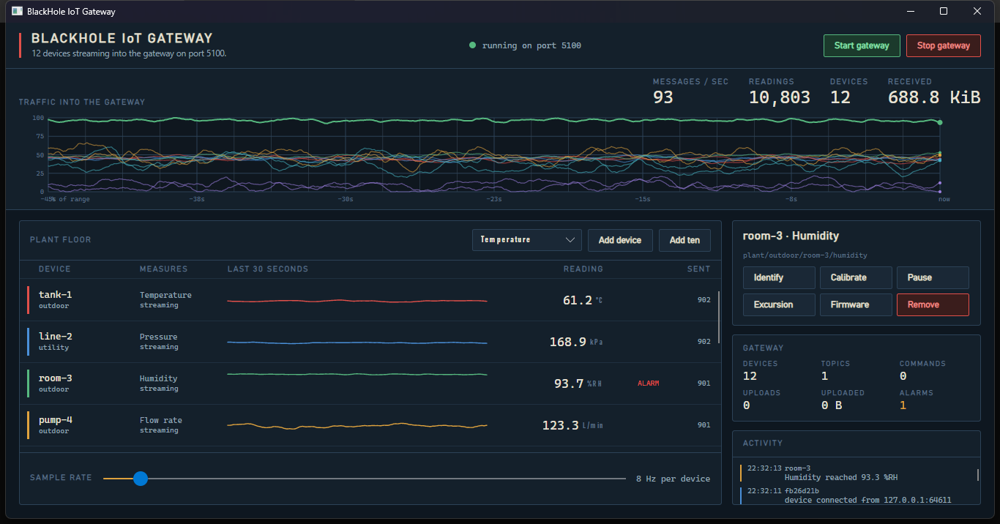
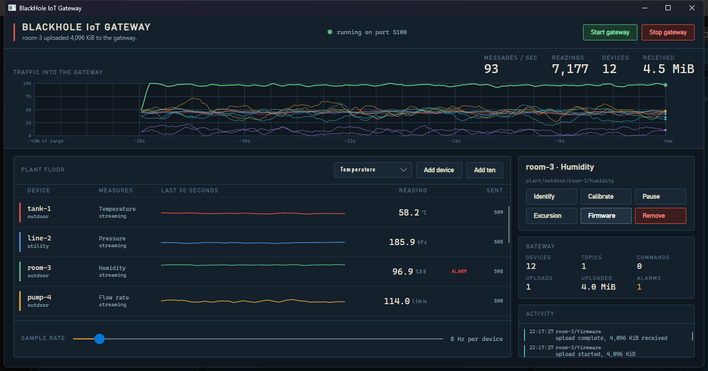

# BlackHole Messaging 🕳️

[](https://www.nuget.org/packages/BlackHole.Messaging)
[](https://dotnet.microsoft.com/)
[](LICENSE)
[](https://github.com/DotNetVibeCoderz/Vibe_Messaging/actions/workflows/blackhole-ci.yml)

High-performance network messaging for .NET 10. A custom length-prefixed binary protocol over TCP
with **RPC**, **Pub/Sub**, **Streaming** and **Batching** — built on `System.IO.Pipelines` so the
steady state allocates nothing per message.

**Built by [Gravicode Studios](https://github.com/DotNetVibeCoderz), led by Kang Fadhil.**

[Bahasa Indonesia](#-bahasa-indonesia) · [English](#-english) · [Documentation](docs/) · [Benchmarks](docs/benchmarks.md)



---

<a name="english"></a>
## 🇬🇧 English

### Install

```bash
dotnet add package BlackHole.Messaging
```

> The id `BlackHole` was already taken on nuget.org, so the package ships as **BlackHole.Messaging**.
> The assembly and every namespace are still `BlackHole.*`.

### Thirty seconds

```csharp
using BlackHole.Hosting;

// Server
await using var server = new BlackHoleServer(5000);
server.Rpc.RegisterText("upper", text => text.ToUpperInvariant());
server.Start();

// Client
await using var client = await BlackHoleClient.ConnectAsync("127.0.0.1", 5000);
string result = await client.Rpc.CallTextAsync("upper", "halo blackhole");   // "HALO BLACKHOLE"

// Pub/Sub, with MQTT-style wildcards
client.PubSub.Received += (topic, payload) => Console.WriteLine($"{topic}: {payload.Length} B");
await client.PubSub.SubscribeAsync("sensor/+/temperature");
await client.PubSub.PublishAsync("sensor/tank-3/temperature", "28.4");
```

### What it does

| Pattern | What you get |
|---|---|
| **RPC** | Request/response with correlation, per-call deadlines, and errors that propagate as `RpcException` instead of hanging. Works in both directions on one socket. |
| **Pub/Sub** | Topic broker with `+` and `#` wildcards. Exact topics resolve through a dictionary; wildcards are matched allocation-free. |
| **Streaming** | Send a body of any size in chunks, with a descriptor, progress reporting, and an optional sink so a large upload never has to sit in memory. |
| **Batching** | Pack many small messages into one frame and one socket write. Flushes on count, size, or a delay — whichever comes first. |
| **Keepalive** | Ping/pong answered by the transport, never surfaced to your handlers, with a round-trip measurement per connection. |

### Measured on this machine

.NET 10.0.11, Windows 11, 8 logical cores, loopback TCP, both ends in one process.

| | |
|---|---|
| RPC round trip | **41 µs** p50, 110 µs p99, **21,100 calls/sec** sequential |
| RPC with 16 connections | **200,800 calls/sec** |
| Pub/Sub fan-out | **69,700 deliveries/sec** across 50 subscribers |
| Batched publishes | **2.3 M messages/sec** — 22× the one-send-per-message path |
| Streaming | **520 MiB/sec** at a 16 KiB chunk size |
| Encode a frame | **41 ns**, **0 bytes allocated** |
| Decode a frame | **105 ns**, **0 bytes allocated** |

Full numbers, method, and how to reproduce them: **[docs/benchmarks.md](docs/benchmarks.md)**.

### Run it

```bash
dotnet run --project src/BlackHole.Demo          # every pattern, end to end
dotnet run --project src/BlackHole.IoTGateway    # the Avalonia gateway panel
dotnet test tests/BlackHole.Tests                # 40 tests
```

### The IoT Gateway simulator

An Avalonia desktop panel that runs a real BlackHole gateway and attaches as many simulated sensor
devices as you like — each one a genuine client on a genuine socket. Nothing in it is mocked.

```bash
dotnet run --project src/BlackHole.IoTGateway -- --demo 12
```



Every pattern in the library is operable from the panel: devices publish telemetry, the gateway
calls RPC methods back down the same connection the device dialled out on, and **Firmware** uploads
4 MiB as a stream while the traces keep running. See [docs/iot-gateway.md](docs/iot-gateway.md).

### Documentation

| | |
|---|---|
| [Getting started](docs/getting-started.md) | Install, first server, first client |
| [Architecture](docs/architecture.md) | How the layers fit together, and why |
| [Protocol](docs/protocol.md) | The wire format, byte by byte |
| [Patterns](docs/patterns.md) | RPC, Pub/Sub, Streaming, Batching in depth |
| [Performance](docs/performance.md) | Where the allocations went, and how to keep them gone |
| [Benchmarks](docs/benchmarks.md) | Full results and how to reproduce them |
| [IoT Gateway](docs/iot-gateway.md) | The simulator, and what it demonstrates |
| [Migrating from v2](docs/migration-v2.md) | What changed and why |

Bahasa Indonesia: [docs/id/](docs/id/).

---

<a name="bahasa-indonesia"></a>
## 🇮🇩 Bahasa Indonesia

### Instalasi

```bash
dotnet add package BlackHole.Messaging
```

> Nama `BlackHole` sudah dipakai orang lain di nuget.org, jadi paket ini bernama
> **BlackHole.Messaging**. Nama assembly dan seluruh namespace tetap `BlackHole.*`.

### Tiga puluh detik

```csharp
using BlackHole.Hosting;

// Server
await using var server = new BlackHoleServer(5000);
server.Rpc.RegisterText("upper", text => text.ToUpperInvariant());
server.Start();

// Client
await using var client = await BlackHoleClient.ConnectAsync("127.0.0.1", 5000);
string hasil = await client.Rpc.CallTextAsync("upper", "halo blackhole");   // "HALO BLACKHOLE"

// Pub/Sub, dengan wildcard ala MQTT
client.PubSub.Received += (topik, isi) => Console.WriteLine($"{topik}: {isi.Length} B");
await client.PubSub.SubscribeAsync("sensor/+/temperature");
await client.PubSub.PublishAsync("sensor/tank-3/temperature", "28.4");
```

### Apa saja yang tersedia

| Pola | Yang Anda dapat |
|---|---|
| **RPC** | Request/response dengan korelasi, batas waktu per panggilan, dan kegagalan yang muncul sebagai `RpcException` — bukan menggantung selamanya. Bisa dua arah di satu soket. |
| **Pub/Sub** | Broker topik dengan wildcard `+` dan `#`. Topik persis dicari lewat dictionary; wildcard dicocokkan tanpa alokasi. |
| **Streaming** | Kirim data sebesar apa pun dalam potongan, lengkap dengan deskriptor, laporan progres, dan sink opsional supaya unggahan besar tidak perlu menumpuk di memori. |
| **Batching** | Gabungkan banyak pesan kecil jadi satu frame dan satu tulisan soket. Dikirim saat jumlah, ukuran, atau jeda tercapai — mana yang lebih dulu. |
| **Keepalive** | Ping/pong dijawab oleh transport sendiri, tidak pernah sampai ke handler Anda, sekaligus mengukur waktu bolak-balik tiap koneksi. |

### Hasil pengukuran di mesin ini

.NET 10.0.11, Windows 11, 8 core logis, TCP loopback, kedua sisi dalam satu proses.

| | |
|---|---|
| Bolak-balik RPC | **41 µs** p50, 110 µs p99, **21.100 panggilan/detik** berurutan |
| RPC dengan 16 koneksi | **200.800 panggilan/detik** |
| Sebaran Pub/Sub | **69.700 pengiriman/detik** ke 50 pelanggan |
| Publish ter-batch | **2,3 juta pesan/detik** — 22× lebih cepat daripada kirim satu per satu |
| Streaming | **520 MiB/detik** dengan potongan 16 KiB |
| Menyusun satu frame | **41 ns**, **0 byte dialokasikan** |
| Membaca satu frame | **105 ns**, **0 byte dialokasikan** |

Angka lengkap, metode pengukuran, dan cara mengulanginya: **[docs/benchmarks.md](docs/benchmarks.md)**.

### Menjalankannya

```bash
dotnet run --project src/BlackHole.Demo          # semua pola, dari ujung ke ujung
dotnet run --project src/BlackHole.IoTGateway    # panel gateway Avalonia
dotnet test tests/BlackHole.Tests                # 40 tes
```

### Simulator IoT Gateway

Panel desktop Avalonia yang menjalankan gateway BlackHole sungguhan dan menyambungkan sebanyak
apa pun perangkat sensor simulasi — masing-masing klien sungguhan di atas soket sungguhan. Tidak
ada bagian yang dipalsukan.

```bash
dotnet run --project src/BlackHole.IoTGateway -- --demo 12
```

Semua pola di pustaka ini bisa dioperasikan dari panel: perangkat mengirim telemetri, gateway
memanggil metode RPC balik lewat koneksi yang sama yang tadi dibuka perangkat, dan tombol
**Firmware** mengunggah 4 MiB sebagai stream sementara grafiknya tetap berjalan. Lihat
[docs/id/iot-gateway.md](docs/id/iot-gateway.md).

### Dokumentasi

Dokumentasi berbahasa Indonesia ada di **[docs/id/](docs/id/)**:
[Panduan awal](docs/id/getting-started.md) ·
[Arsitektur](docs/id/architecture.md) ·
[Protokol](docs/id/protocol.md) ·
[Pola](docs/id/patterns.md) ·
[Performa](docs/id/performance.md) ·
[IoT Gateway](docs/id/iot-gateway.md)

---

## License

MIT. See [LICENSE](LICENSE).

Built by **Gravicode Studios**, led by **Kang Fadhil**.
