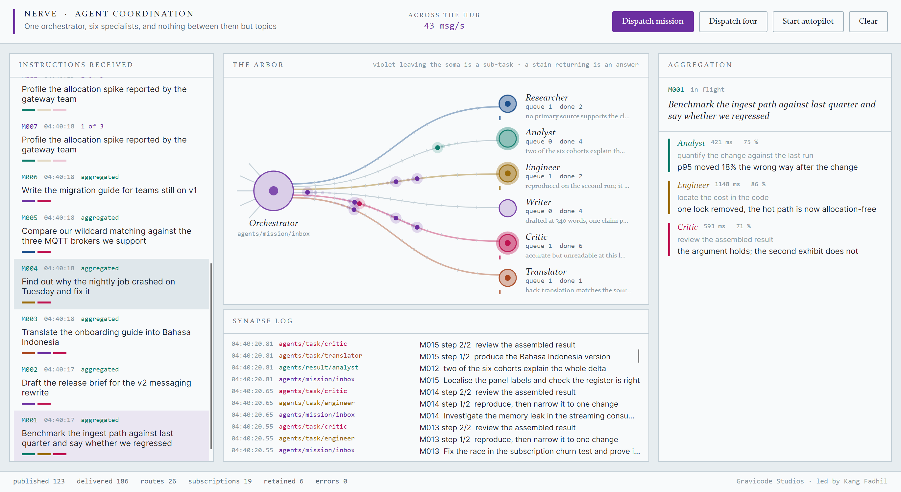
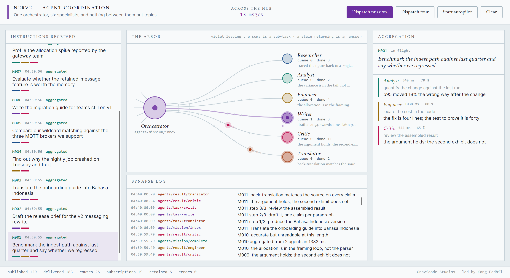

# The agent coordination simulator

Built by Gravicode Studios, led by Kang Fadhil.

```bash
dotnet run --project src/Nerve.AgentSim                 # empty, waiting for you to dispatch
dotnet run --project src/Nerve.AgentSim -- --demo 8     # feeds eight instructions in
```



## What it is

An orchestrator is handed instructions. It plans each one from the words in it, dispatches the
pieces to six specialists, and folds their answers back into a digest.

It exists to answer a question the benchmarks cannot: *what does a system built on Nerve actually
look like?* So the constraint the whole thing is built under is that **no agent holds a reference to
another**. Every arrow on screen is a topic.

## The topics

| Topic | Carries | Published by | Subscribed by |
|---|---|---|---|
| `agents/mission/inbox` | `Mission` | the panel | the orchestrator, as a stream |
| `agents/task/{specialty}` | `SubTask` | the orchestrator | that specialist, as a stream |
| `agents/result/{specialty}` | `SubResult` | that specialist | the orchestrator, on `agents/result/+` |
| `agents/mission/complete` | `MissionDigest` | the orchestrator | the panel |
| `agents/roster/{specialty}` | `AgentStatus` | that specialist, **retained** | the panel, on `agents/roster/+` |
| `agents/{specialty}/capability` | request/reply | — | that specialist, on `agents/+/capability` |

A seventh specialist would start receiving work the moment it subscribed to its own task topic.
Nothing in the orchestrator would change.

## Why the specialists use streams

A subscription handler runs on the publishing thread. If a specialist slept inside one, it would be
sleeping on the orchestrator's dispatch loop, and the six agents would take turns instead of working
at once.

So each specialist takes work through `StreamAsync`, which gives it a buffer and its own loop:

```csharp
await foreach (SubTask task in _hub.StreamAsync<SubTask>(Topics.TaskFor(Specialty), 256, token))
{
    SubResult result = await WorkAsync(task, token);
    await _hub.PublishAsync(_resultTopic, result, token);
}
```

The orchestrator does the opposite for results, on purpose. Folding an answer into a dictionary is a
few microseconds, so it runs inline on the specialist's thread — handing it to another one would
cost more than it saves.

That contrast is the point of the example: **stream when the work is slow, subscribe when it is
not.**

## Why the roster is retained

Specialists publish their status with `PublishRetainedAsync`. When the panel subscribes to
`agents/roster/+`, all six retained values are delivered before `Subscribe` returns — so the six
terminals are populated the instant the window opens, rather than filling in as work happens.

## How the orchestrator plans

`Orchestrator.Plan` matches keywords in the instruction:

| Words | Steps added |
|---|---|
| benchmark, latency, throughput, measure, profile, allocation | Analyst, Engineer |
| translate, bahasa, indonesian, localise | Translator |
| bug, crash, regression, fix, refactor, leak, race | Engineer |
| survey, compare, research, evaluate, prior art, sources | Researcher |
| draft, brief, announce, write, guide, readme, post, summary | Writer |
| *nothing matched* | Researcher, Writer |

Every plan then ends with the Critic — the one step that is not about the instruction.

Keyword matching, deliberately. The point of the simulation is the coordination, and a plan that
visibly changes with the wording makes the dispatch legible on screen. A real orchestrator would put
a model behind that method and change nothing else.

## The panel



The panel is a seventh subscriber. It holds no reference to any agent — five wildcard subscriptions
are its entire connection to the simulation:

```csharp
hub.Subscribe<Mission>(Topics.MissionInbox, _inbox.Enqueue);
hub.Subscribe<SubTask>("agents/task/+", _inbox.Enqueue);
hub.Subscribe<SubResult>("agents/result/+", _inbox.Enqueue);
hub.Subscribe<MissionDigest>(Topics.MissionComplete, _inbox.Enqueue);
hub.Subscribe<AgentStatus>("agents/roster/+", _inbox.Enqueue);
```

Those handlers run on agent threads, so **none of them touch a bound collection**. They drop the
message into a `ConcurrentQueue`, and a 33 ms timer on the UI thread drains it and applies one
coalesced batch per frame. Binding a collection straight to a message handler is the same mistake as
updating a UI from a socket read loop.

### Reading the arbor

The orchestrator's soma is on the left, with dendrites pointing at the mission queue — the side
instructions arrive from. Six axons fan out to the specialists.

- **A violet impulse leaving the soma** is a `SubTask` that was really published.
- **An impulse in a specialist's own colour, returning** is their `SubResult`.
- **A lit axon** means that specialist is working.
- **Ticks under a terminal** are its queue depth.
- **Banding along an axon** is myelin, spaced evenly in curve parameter, so it crowds where the
  curve is tightest.

Nothing is emitted on a timer to make the picture livelier. If the arbor is quiet, the hub is quiet.

### Reading the mission queue

Each card carries one pip per planned step, in that specialist's colour, ghosted until they answer.
It says *who* is on the mission as well as how far along it is, which a progress bar cannot.

## Screenshots

The pictures in this documentation are captured from the running panel, not mocked up:

```bash
dotnet run --project src/Nerve.AgentSim -- --screenshot docs/images/agent-sim.png --demo 8 --wait 5600
```

It renders the live visual tree at 2× into a PNG and exits. Whatever the agents happen to be doing
at that moment is what lands in the file.

## Files

```
src/Nerve.AgentSim/
  Agents/AgentMessages.cs    the topics and the record types on them
  Agents/Orchestrator.cs     planning, dispatch, aggregation
  Agents/Specialist.cs       one sub-agent, and the six profiles
  Agents/SimulationHost.cs   the whole wiring: a hub, an orchestrator, six specialists
  Controls/Arbor.cs          the signal map
  Controls/ArborField.cs     what is in flight, advanced on the UI thread only
  ViewModels/MainViewModel.cs  the five subscriptions and the frame drain
  Views/MainWindow.axaml     three columns, in the order work moves
  Theme.axaml                the palette and the three typefaces
```
