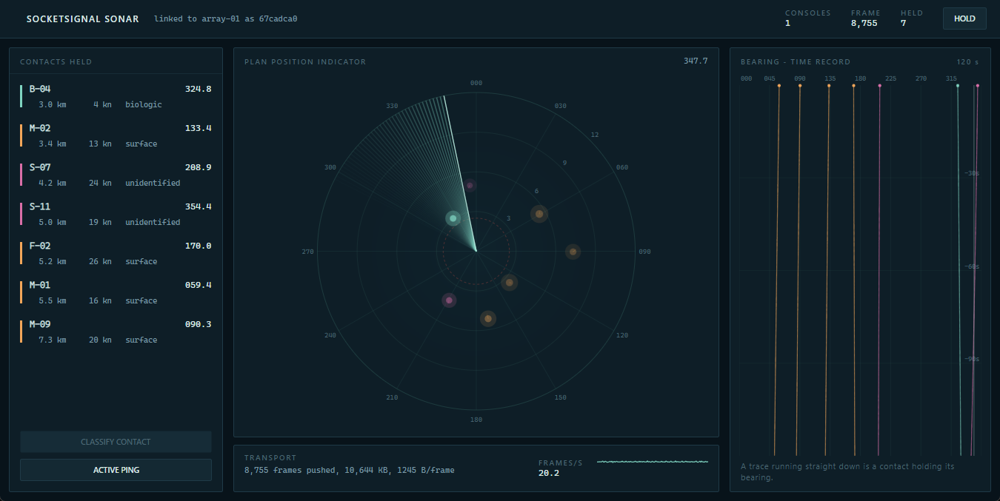
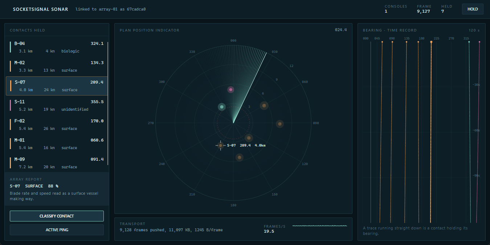

# Konsol sonar

*Gravicode Studios, dipimpin oleh Kang Fadhil.*



Simulator sonar laut yang dibangun dengan Avalonia, dibuat untuk memberi SocketSignal beban kerja
sungguhan — bukan sekadar menggambarkannya lewat diagram.

```bash
dotnet run --project src/SocketSignal.SonarDemo
```

## Apa yang sebenarnya terjadi

Dua peer SocketSignal berjalan dalam satu proses, dan keduanya berbicara lewat WebSocket sungguhan:

**Array sonar** (`SonarStation`) adalah `SocketSignalServer` di `ws://localhost:8123/sonar/`. Ia
memegang keadaan laut: tujuh kontak, masing-masing dengan bearing, jarak, haluan, dan kecepatan,
yang dimajukan dua puluh kali per detik. Setelah setiap langkah, ia mengirim `SweepFrame` — bearing
berkas plus seluruh gema — ke grup `operators`.

**Konsolnya** (`MainWindow`) adalah `SocketSignalClient`. Ia memanggil `sonar.attach` agar
dimasukkan ke grup operator, lalu menggambar apa pun yang tiba. Konsol tidak menyimpan keadaan laut
sendiri; kalau tautannya berhenti, gambarnya ikut berhenti.

Batasan itulah intinya. Konsol sebenarnya bisa saja membaca `SonarStation` langsung — satu proses,
satu memori — dan demo ini tidak akan membuktikan apa pun. Dengan melewati socket, kode di sini
adalah kode yang sama yang akan berjalan bila konsolnya berada dua dek di atas.

### Setiap fitur, benar-benar dipakai

| Fitur | Di mana |
|---|---|
| Client → server, dengan nilai balik | `sonar.attach`, `sonar.classify`, `sonar.ping` |
| Server → grup | frame sweep, 20×/detik ke `operators` |
| Grup | konsol bergabung ke `operators` di dalam handler `sonar.attach` |
| Panggilan satu argumen bertipe | `SendToGroupAsync(..., frame)` — satu record, tanpa `object[]` |
| Perambatan error | klasifikasikan track yang sudah hilang, dan pesannya kembali ke konsol |
| Keepalive + sambung ulang otomatis | matikan array-nya, lampu tautan memerah, lalu pulih |

Menekan **Classify** adalah contoh paling jelas: ia memanggil `sonar.classify` dan menunggu sekitar
setengah detik sampai array menjawab. Jeda itu disengaja — itulah yang membuatnya menjadi panggilan
request-response, bukan broadcast, dan itulah sebabnya tombolnya berbunyi *Studying return* selama
menunggu.



## Dua instrumen

Konsol menampilkan kontak yang sama dua kali, dan itulah yang membuatnya menjadi konsol sonar,
bukan sekadar layar radar bertitik-titik.

**Plan position indicator** menjawab *di mana benda itu*. Berkas menyapu searah jarum jam dari utara
pada 60°/detik; sebuah kontak berada pada kecerahan penuh tepat saat berkas melewatinya, lalu
meredup seiring berkas menjauh — persis perilaku tabung fosfor. Jadi kecerahan bukan hiasan: ia
memberi tahu operator seberapa lama sejak array benar-benar mendengar sesuatu. Cincin jarak digambar
tiap 3 km, dan cincin merah putus-putus di 2,5 km adalah batas jarak dekat: kontak di dalamnya
berubah merah, satu-satunya merah pekat di seluruh konsol.

**Bearing-time recorder** menjawab *apa yang sedang dilakukannya*. Bearing membentang mendatar,
waktu mengalir ke bawah, yang terbaru di atas, dan setiap kontak menggambar jejak sepanjang 120
detik terakhir. Inilah instrumen yang benar-benar dibaca operator sonar, dan ia menunjukkan hal yang
tidak bisa ditunjukkan scope: jejak yang turun lurus berarti kontak yang mempertahankan bearing-nya,
tanda klasik sesuatu yang berada di jalur tabrakan. Jejak yang menarik ke kiri atau kanan berarti
kontak yang melintas.

Keduanya diikat oleh garis rambut pada recorder yang menandai posisi berkas, dan oleh pemilihan —
mengklik sebuah kontak, baik di daftar maupun di scope, menyorotinya di kedua instrumen.

## Rancangan visual

Briefnya adalah "sonar", dan jawaban standar untuk brief itu adalah layar hitam dengan sapuan hijau
menyala. Itu versi film, bukan versi instrumennya, jadi konsol ini berpijak di tempat lain:

**Warna.** Dasarnya biru-hijau pekat (`#08131A`) — kertas peta basah di bawah lampu malam, bukan
hitam. Gema berwarna aquamarine pucat (`#7FD4C1`): berdekatan dengan fosfor, tetapi berasal dari
laut, bukan `#39FF14` milik setiap screensaver sonar. Klasifikasi memakai konvensi peta — amber
untuk permukaan, biru pucat untuk bawah air, dan magenta Admiralty untuk yang belum dikenali, karena
magenta adalah warna yang memang dicadangkan peta sungguhan untuk peringatan. Merah muncul tepat
sekali, pada jarak dekat, sehingga ketika ia muncul artinya sungguh-sungguh.

**Tipografi.** Label panel disusun kecil, huruf besar, dengan jarak huruf lebar, seperti cara
silkscreen instrumen dicetak. Semua angka memakai huruf monospace, karena bearing yang berubah lebar
saat nilainya berubah mustahil dibaca sekilas — itu kebutuhan fungsional di layar ini, bukan
kebutuhan gaya.

**Struktur.** Perangkat strukturalnya membawa informasi: bearing dalam derajat, jarak dalam
kilometer, waktu dalam detik ke belakang. Tidak ada penomoran dekoratif, karena tidak ada satu pun
di sini yang berupa urutan.

Seluruh palet dan skala tipografinya ada di
[`Theme.axaml`](../../src/SocketSignal.SonarDemo/Theme.axaml), satu berkas, lengkap dengan komentar.

## Susunan kode

```
src/SocketSignal.SonarDemo/
├── Simulation/
│   ├── Contact.cs        record yang melintasi jaringan: ContactEcho, SweepFrame, ClassificationResult
│   ├── SonarStation.cs   array: server, keadaan laut, dan method yang dibukanya
│   └── ConsoleModel.cs   apa yang diketahui konsol, dirakit dari frame yang diterimanya
├── Controls/
│   ├── PpiScope.cs       plan position indicator
│   ├── BearingWaterfall.cs bearing-time recorder
│   └── Sparkline.cs      jejak telemetri
├── Theme.axaml           palet dan tipografi
└── MainWindow.axaml(.cs) tata letak, dan perkabelan jaringannya
```

Kedua instrumen digambar di `Render(DrawingContext)`, bukan disusun dari bentuk XAML: pada 60 fps
dengan jejak dan riwayat 120 detik, bentuk yang disimpan (retained) adalah alat yang keliru.

## Hal yang layak dicoba

- **Perhatikan strip telemetri.** Ia melaporkan frame terkirim, kilobyte, dan byte per frame
  langsung dari `SignalStatistics`. Satu frame sweep berisi tujuh kontak berukuran sekitar 1,2 KB,
  dua puluh kali per detik.
- **Tekan Hold.** Konsol berhenti menerapkan frame; array tetap mengirim. Lepaskan dan ia menyusul
  dari gambar terkini, bukan dari antrean — tidak ada tumpukan yang perlu diputar ulang.
- **Tekan Active ping.** Satu panggilan, dan setiap kontak dalam jangkauan menjawab pada kekuatan
  penuh selama tiga detik. Balasannya adalah jumlah yang tersinari.
- **Klasifikasikan si biologic.** Array melaporkan *broadband, no tonals* — kasus kecepatan rendah
  dengan gema kuat di `SonarStation.Classify`.
- **Matikan array-nya.** Hentikan bagian server dari proses itu dan lampu tautan berubah merah;
  `AutoReconnect` milik client mulai mundur bertahap dan status rail menghitung percobaannya.
